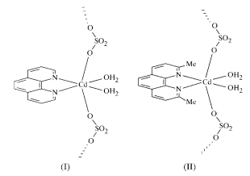
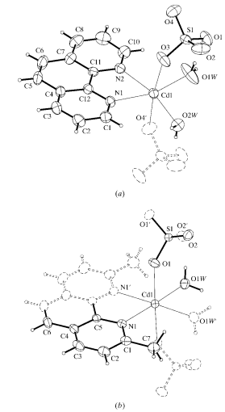
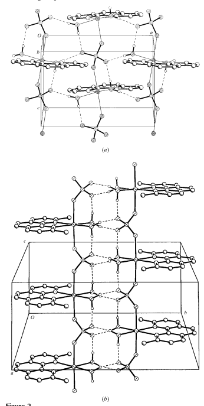

Acta Crystallographica Section C
Crystal Structure Communications ISSN 0108-2701 catena-Poly[[diaqua(1,10-phenanthroline-N,N0)cadmium(II)]-l-(sulfato- O:O0)] and catena-poly[[diaqua(2,9dimethyl-1,10-phenanthroline-N,N0)- cadmium(II)]-l-(sulfato-O:O0)]
Miguel Harvey,a Sergio Baggio,b Leopoldo Suescunc and Ricardo F. Baggiod* aUniversidad Nacional de la Patagonia, Sede Trelew and CenPat, CONICET, 9120 Puerto Madryn, Chubut, Argentina, bUniversidad Nacional de la Patagonia, Sede Puerto Madryn and CenPat, CONICET, 9120 Puerto Madryn, Chubut, Argentina, cCSSC Lab., Facultad de QuõÂmica, Universidad de la RepuÂblica, Montevideo, Uruguay, and dDepartamento de FõÂsica, ComisioÂn Nacional de EnergõÂa AtoÂmica, Buenos Aires, Argentina Correspondence e-mail: baggio@cnea.gov.ar Received 25 January 2000 Accepted 25 April 2000 Both title compounds, [Cd(SO4)(C12H8N2)(H2O)2]n and [Cd(SO4)(C14H12N2)(H2O)2]n, respectively, are polymeric and present the Cd atoms in very similar octahedral environments, provided by the bidentate organic ligand (phenanthroline/dimethylphenanthroline), two aqua molecules and two O atoms from two translationally related sulfate groups, which thus act as links in the resulting polymeric chains.

# Comment

Cadmium(II) complexes have been extensively studied from a chemical and structural point of view, mainly due to the capability of cadmium(II) (shared by most d10 metal ions) to adopt different modes of coordination determined by considerations of size, as well as electrostatic and covalent bonding forces. The presence of sulfate as a ligand introduces some additional degrees of freedom, due to its versatility in acting as a monodentate, bidentate or bridging ligand.

This latter mode of coordination has been reported so far in four Cd±sulfate complexes, as revealed by a search of the Cambridge Structural Database (Allen & Kennard, 1993). In three of these complexes, namely bis(-sulfato)tetraaquabis(-cyanoguanidine)dicadmium(II) (Hubberstey & Falshaw, 1982), catena-[(-sulfato-O,O0)aqua(2,20-bipyridyl-N,N0)(2-imidazolinethione-S)cadmium(II)] monohydrate (Rodesiler et al., 1987) and bis(thiosemicarbazide)cadmium(II) sulfate (Larsen & Trinderup, 1975), the bridging sulfates are in trans positions. However, in the fourth complex, catena-[cis-(-sulfato)aquatris(imidazole)cadmium(II)]
(Caira et al., 1976), the anionic ligands are located in cis positions.

The two polymeric structures presented herein, [Cd(phen)-

(SO4)(H2O)2], (I), and [Cd(dmph)(SO4)(H2O)2], (II) (Figs. 1a and 1b, respectively), where phen is 1,10-phenanthroline and dmph is 2,9-dimethyl-1,10-phenanthroline, are examples of

 the former bridging case (trans ligands). In spite of crystallizing in quite different space groups and displaying different degrees of local symmetry, the structures have many features Figure 1 Molecular diagrams of (a) compound (I) and (b) compound (II) showing the numbering schemes used. Displacement ellipsoids are drawn at the 50% level. Note the twofold axis across the molecule in (b).

# Metal-Organic Compounds

in common. The main similarities are that both compounds

 form polymeric chains constituted by the stacking of Cd octahedra, the equatorial planes of which are de®ned by the close bidentate bite of the organic ligand plus two coordinated water molecules. The apical sites, in turn, are occupied by two O atoms of the sulfate anion, which thus acts as the bridging link of the chains.

For the four cadmium sulfate bridging complexes reported in the literature, the CdÐO(SO3) distances vary in an ample range (2.259 to 2.525 AÊ ), with the values found in (I) [2.320 (3) and 2.326 (3) AÊ ] and (II) [2.370 (2) AÊ ], being in the lower half of the range reported.

Figure 2
Simpli®ed packing diagrams showing hydrogen-bonding interactions for
(a) compound (I) and (b) compound (II).

Among the differences between the two structures is the effect of the two bulky methyl groups on the geometry of the equatorial plane in (II), pushing the two water molecules into each other and stretching the OWÐCdÐOW angle [81.6 (1)] to a much smaller value than in the unconstrained case [97.8 (2) in (I)]. This effect will be discussed further when describing the packing. The angle contraction is accompanied by a small but perceptible lengthening of the CdÐOW bond lengths, of ca 3.5%. Another difference is to be found in the local symmetry of the polyhedra, which in (I) lie in general positions (space group P212121), but in (II) (space group C2/c), the cation as well as the S atom lie in special positions of type e, on two different twofold axis, thus rendering only half of the molecule independent. In both structures, the two aqua molecules attached to each cation are fully involved in hydrogen bonding, each one making one `intra-chain' bond, in the direction of, and reinforcing, the link determined by the bridging sulfate, and a second one connecting neighbouring chains (Figs. 2a and 2b). The similarities end here, as the differences which both polyhedra exhibit in the OWÐCdÐOW angle determine the way in which the chains pack; the close approach of both water molecules in (II) determines that they can interact with one and only one of the neighbouring chains, due to steric hindrance. As a consequence, a ribbon made up of two parallel chains results. In the case of (I), instead, the much more open geometry permits the approach of two parallel chains, one at each side, interacting with one water molecule each and thus de®ning an in®nite two-dimensional structure parallel to (010). Both structures [planes in (I) and ribbons in (II)] share the usual gear-like appearance with the organic ligands protruding outwards and ®tting into the hollows left by adjacent homologous groups in the neighbouring structures. The thus interleaved ligands give rise to a `dovetail' structure, with the planar groups parallel to each other at the characteristic graphitic distance of ca 3.40 AÊ .

# Experimental

The direct mixing of a 0.075 M aqueous solution of 3CdSO48H2O
and an ethanolic solution of phenanthroline gave a white precipitate, which when recrystallized from boiling water yielded well developed colourless needles of (I) suitable for X-ray studies. Slow diffusion of a 0.025 M alcoholic solution of dimethylphenanthroline into an aqueous solution of 3CdSO48H2O developed thin colourless needles of (II). After a week, the specimens had the appropriate size for X-ray analysis.

#### Compound (I)

Crystal data

| [Cd(SO4)(C12H8N2)(H2O)2]   | Mo K radiation                         |
|----------------------------|-------------------------|
| Mr = 424.70                | Cell parameters from 25 |
| Orthorhombic, P212121      | re¯ections              |
| a = 10.352 (1) AÊ          |  = 7.5±15.0                         |
| b = 20.083 (2) AÊ          |  = 1.72 mmÿ1                         |
| c = 6.828 (4) AÊ           | T = 293 (2) K           |
| V = 1419.5 (9) AÊ 3        | Needle, colourless      |
| Z = 4                      | 0.40  0.15  0.12 mm                         |

#### Data Collection

Rigaku AFC-7S diffractometer !/2 scans Absorption correction: scan
(Molecular Structure Corporation, 1988)
Tmin = 0.57, Tmax = 0.80 2536 measured re¯ections 1894 independent re¯ections (plus 454 Friedel-related re¯ections)

#### Re®Nement

Re®nement on F2 R[F2 > 2(F2)] = 0.026 wR(F2) = 0.076 S = 0.995 2348 re¯ections 217 parameters H atoms treated by a mixture of independent and constrained re®nement

| Cd1ÐO1W   | 2.243 (3)   | Cd1ÐN1   | 2.341 (3)   |
|-----------|-------------|----------|-------------|
| Cd1ÐO2W   | 2.243 (3)   | S1ÐO2    | 1.466 (3)   |
| Cd1ÐN2    | 2.312 (3)   | S1ÐO4    | 1.466 (3)   |
| Cd1ÐO4i   | 2.320 (3)   | S1ÐO3    | 1.468 (3)   |
| Cd1ÐO3    | 2.326 (3)   | S1ÐO1    | 1.472 (3)   |

#### Table 1

| DÐHA   | DÐH      | HA          | DA           | DÐHA         |
|---|----------|----------|-----------|---------|
| O1WÐH1WAO1   | 0.77 (4) | 1.87 (4) | 2.650 (6) | 178 (4) |
| O1WÐH1WBO2i   | 0.77 (4) | 1.92 (4) | 2.681 (5) | 165 (4) |
| O2WÐH2WBO1ii   | 0.75 (3) | 1.91 (4) | 2.652 (4) | 166 (3) |
| O2WÐH2WAO2iii   | 0.76 (3) | 1.89 (3) | 2.647 (5) | 172 (3) |

Selected bond lengths (AÊ ) for (I).

Symmetry code: (i) x; y; z ÿ 1.

Table 2 Hydrogen-bonding geometry (AÊ , ) for (I).

Symmetry codes: (i) 12  x; ÿ12 ÿ y; ÿ1 ÿ z; (ii) x ÿ 12; ÿ12 ÿ y; ÿ1 ÿ z; (iii) x; y; z ÿ 1.

# Compound (Ii)

Crystal data [Cd(SO4)(C14H12N2)(H2O)2] Mr = 452.75 Monoclinic, C2=c a = 15.384 (3) AÊ b = 14.826 (3) AÊ c = 6.926 (1) AÊ
 = 107.54 (3)
V = 1506.3 (5) AÊ 3 Z = 4

#### Data Collection

Rigaku AFC-7S diffractometer !/2 scans tion, 1988)
Tmin = 0.69, Tmax = 0.82 1787 measured re¯ections 1622 re¯ections with I > 2(I)
2084 re¯ections with I > 2(I)
Rint = 0.016 max = 27.49 h = ÿ1 ! 13 k = ÿ1 ! 26 l = ÿ1 ! 8 3 standard re¯ections every 150 re¯ections intensity decay: <3%
w = 1/[2(Fo 2) + (0.047P)
2 + 0.415P]
where P = (Fo 2 + 2Fc 2)/3
(/)max < 0.01 max = 0.65 e AÊ ÿ3 min = ÿ0.78 e AÊ ÿ3 Extinction correction: SHELXL97 Extinction coef®cient: 0.0042 (5) Absolute structure: Flack (1983)
Flack parameter = ÿ0.01 (4)

#### Re®Nement

Re®nement on F2 R[F2 > 2(F2)] = 0.026 wR(F2) = 0.073 S = 1.050 1727 re¯ections 120 parameters Table 3 Selected bond lengths (AÊ ) for (II).

#### Table 4

Hydrogen-bonding geometry (AÊ , ) for (II).

| Cd1ÐO1W   | 2.308 (2)   | S1ÐO1   | 1.4751 (18)   |
|-----------|-------------|---------|---------------|
| Cd1ÐN1    | 2.340 (2)   | S1ÐO2   | 1.4804 (18)   |
| Cd1ÐO1    | 2.370 (2)   |         |               |

Symmetry codes: (i) 1 ÿ x; 2 ÿ y; ÿz; (ii) 1 ÿ x; y; ÿ12 ÿ z.

| DÐHA   | DÐH      | HA          | DA           | DÐHA         |
|---|----------|----------|-----------|---------|
| O1WÐH1WAO2i   | 0.92 (3) | 1.82 (3) | 2.726 (3) | 165 (3) |
| O1WÐH1WBO2ii   | 0.93 (3) | 1.76 (3) | 2.686 (3) | 171 (3) |

H atoms attached to carbon were idealized; those unambiguously determined by the stereochemistry were allowed to ride, while those in the methyl groups were allowed to rotate as a rigid ideal group as well. Finally, those attached to oxygen were found in the difference Fourier map and re®ned with softly restrained OÐH and HH
distances and individual isotropic displacement parameters.

For both compounds, data collection, cell re®nement and data reduction: MSC/AFC Diffractometer Control Software (Molecular Structure Corporation, 1988); program(s) used to solve structure: SHELXS97 (Sheldrick, 1990); program(s) used to re®ne structure: SHELXL97 (Sheldrick, 1997); molecular graphics: XP in SHELXTL/PC (Sheldrick, 1994); software used to prepare material for publication: PARST (Nardelli, 1983) and CSD (Allen & Kennard, 1993).

| Rint = 0.030          |
|-----------------------|
| max = 27.50                       |
| h = 0 ! 19            |
| k = 0 ! 19            |
| l = ÿ8 ! 8            |
| 3 standard re¯ections |
| every 150 re¯ections  |
| intensity decay: <3%  |

| Dx = 1.996 Mg mÿ3       |
|-------------------------|
| Mo K radiation                         |
| Cell parameters from 25 |
| re¯ections              |
|  = 7.5±15.0                         |
|  = 1.62 mmÿ1                         |
| T = 293 (2) K           |
| Needle, colourless      |
| 0.28  0.12  0.12 mm                         |

This work was partially supported by a CONICET grant, PIP 0470/98. We thank the Spanish Research Council (CSIC) for providing us with a free-of-charge license to the Cambridge Structural Database system.

Supplementary data for this paper are available from the IUCr electronic archives (Reference: BK1526). Services for accessing these data are described at the back of the journal.

# References

Allen, F. H. & Kennard, O. (1993). Chem. Des. Autom. News, 8, 31±37. Caira, M. R., Nassimbeni, L. R. & Orpen, G. (1976). Acta Cryst. B32, 140±144. Flack, H. D. (1983). Acta Cryst. A39, 876±881. Hubberstey, P. & Falshaw, C. P. (1982). J. Chem. Res. 7, 176±177. Larsen, E. & Trinderup, P. (1975). Acta Chem. Scand. Ser. A, 29, 481±488. Molecular Structure Corporation (1988). MSC/AFC Diffractometer Control Software. MSC, 3200 Research Forest Drive, The Woodlands, TX 77381, USA.

Nardelli, M. (1983). Comput. Chem. 7, 95±98. Rodesiler, P. F., Charles, N. G., Grif®th, E. A. H. & Amma, E. L. (1987). Acta Cryst. C43, 1058±1061.

Sheldrick, G. M. (1990). Acta Cryst. A46, 467±473. Sheldrick, G. M. (1994). SHELXTL/PC. Version 5.0. Siemens Analytical X-ray Instruments Inc., Madison, Wisconsin, USA.

Sheldrick, G. M. (1997). SHELXL97. University of GoÈttingen, Germany.

Absorption correction: scan
(Molecular Structure Corpora1727 independent re¯ections

# Metal-Organic Compounds

H atoms treated by a mixture of independent and constrained re®nement w = 1/[2(Fo 2) + (0.046P)
2 + 0.887P]
where P = (Fo 2 + 2Fc 2)/3
(/)max < 0.01 max = 0.63 e AÊ ÿ3 min = ÿ0.98 e AÊ ÿ3

# Supporting Information

Acta Cryst. (2000). C56, 811-813 [doi:10.1107/S010827010000617X]
catena-Poly[[diaqua(1,10-phenanthroline-N,N′)cadmium(II)]-µ-(sulfato-O:O′)] and *catena*-poly[[diaqua(2,9-dimethyl-1,10-phenanthroline-N,N′)cadmium(II)]- µ-(sulfato-O:O′)]
Miguel Harvey, Sergio Baggio, Leopoldo Suescun and Ricardo F. Baggio Computing details For both compounds, data collection: *MSC/AFC Diffractometer Control Software* (Molecular Structure Corporation, 1988); cell refinement: *MSC/AFC Diffractometer Control Software*; data reduction: MSC/AFC Diffractometer Control Software; program(s) used to solve structure: *SHELXS97* (Sheldrick, 1990); program(s) used to refine structure: SHELXL97 (Sheldrick, 1997); molecular graphics: XP in *SHELXTL/PC* (Sheldrick, 1994); software used to prepare material for publication: PARST (Nardelli, 1983) and CSD (Allen & Kennard, 1993).

(I) Catena-poly[[diaqua(phenanthroline-N,N′)cadmium(II)-µ-(sulfato- O:O**′)]** 

| [Cd(SO4)(C12H8N2)(H2O)2]                  | Dx = 1.987 Mg m−3                                |
|-------------------------------------------|--------------------------------------------------|
| Mr = 424.70                               | Mo Kα radiation, λ = 0.71073 Å                   |
| Orthorhombic, P212121                     | Cell parameters from 25 reflections              |
| a = 10.352 (1) Å                          | θ = 7.5–15°                                      |
| b = 20.083 (2) Å                          | µ = 1.72 mm−1                                    |
| c = 6.828 (4) Å                           | T = 293 K                                        |
| V = 1419.5 (9) Å3                         | Needles, colorless                               |
| Z = 4                                     | 0.40 × 0.15 × 0.12 mm                            |
| F(000) = 840                              |                                                  |
| Data collection                           |                                                  |
| Rigaku AFC7S Difractometer                | 2348 independent reflections                     |
| diffractometer                            | 2084 reflections with I > 2σ(I)                  |
| Radiation source: fine\-focus sealed tube | Rint = 0.016                                     |
| Graphite monochromator                    | θmax = 27.5°, θmin = 2.0°                        |
| ω/2θ scans                                | h = −1→13                                        |
| Absorption correction: ψ scan             | k = −1→26                                        |
| (MSC/AFC Diffractometer Control Software; | l = −1→8                                         |
| Molecular Structure Corporation, 1988)    | 3 standard reflections every 150 reflections     |
| Tmin = 0.57, Tmax = 0.80                  | intensity decay: <3%                             |
| 2536 measured reflections                 |                                                  |
| Refinement                                |                                                  |
| Refinement on F2                          | 2348 reflections                                 |
| Least\-squares matrix: full               | 217 parameters                                   |
| R[F2  > 2σ(F2 )] = 0.026                  | 6 restraints                                     |
| wR(F2 ) = 0.076                           | Primary atom site location: structure\-invariant |
| S = 1.00                                  | direct methods                                   |

Secondary atom site location: difference Fourier map Hydrogen site location: geom+difmap H atoms treated by a mixture of independent and constrained refinement Calculated w = 1/[σ2(Fo 2) + (0.047P)
2 + 0.415P] 
where P = (Fo 2 + 2Fc 2)/3
(Δ/σ)max < 0.01

# Special Details

| Δρmax = 0.65 e Å−3                            |
|-----------------------------------------------|
| Δρmin = −0.78 e Å−3                           |
| Extinction correction: SHELXL97 (Sheldrick,   |
| 1997), Fc* =kFc[1+0.001xFc2 λ3 /sin(2θ)]\-1/4 |
| Extinction coefficient: 0.0042 (5)            |
| Absolute structure: Flack (1983)              |
| Absolute structure parameter: −0.01 (4)       |

|      | x           | y              | z             | Uiso*/Ueq    |
|------|-------------|----------------|---------------|--------------|
| Cd1  | 0.00245 (2) | −0.159722 (11) | −0.76384 (3)  | 0.02405 (11) |
| S1   | 0.01991 (8) | −0.20778 (5)   | −0.26040 (12) | 0.02519 (19) |
| O1   | 0.1423 (3)  | −0.23963 (16)  | −0.3174 (5)   | 0.0409 (7)   |
| O2   | −0.0697 (3) | −0.26019 (17)  | −0.1985 (6)   | 0.0501 (8)   |
| O3   | −0.0324 (3) | −0.17139 (19)  | −0.4291 (4)   | 0.0470 (9)   |
| O4   | 0.0422 (4)  | −0.16136 (15)  | −0.0982 (4)   | 0.0419 (8)   |
| N1   | −0.1686 (3) | −0.08368 (14)  | −0.7813 (6)   | 0.0252 (7)   |
| N2   | 0.0892 (3)  | −0.05366 (15)  | −0.7541 (5)   | 0.0257 (7)   |
| C1   | −0.2948 (3) | −0.09817 (19)  | −0.7861 (8)   | 0.0327 (9)   |
| H1B  | −0.3202     | −0.1426        | −0.7830       | 0.039*       |
| C2   | −0.3898 (4) | −0.0490 (2)    | −0.7953 (8)   | 0.0359 (9)   |
| H2B  | −0.4767     | −0.0606        | −0.7999       | 0.043*       |
| C3   | −0.3546 (4) | 0.01590 (19)   | −0.7972 (7)   | 0.0347 (9)   |
| H3A  | −0.4175     | 0.0490         | −0.8007       | 0.042*       |
| C4   | −0.2238 (4) | 0.03368 (19)   | −0.7927 (7)   | 0.0280 (8)   |
| C5   | −0.1811 (4) | 0.10127 (19)   | −0.7965 (9)   | 0.0388 (11)  |
| H5A  | −0.2415     | 0.1355         | −0.8027       | 0.047*       |
| C6   | −0.0535 (4) | 0.11604 (19)   | −0.7910 (9)   | 0.0432 (11)  |
| H6A  | −0.0272     | 0.1602         | −0.7989       | 0.052*       |
| C7   | 0.0422 (4)  | 0.06442 (18)   | −0.7737 (7)   | 0.0319 (8)   |
| C8   | 0.1749 (4)  | 0.0772 (2)     | −0.7581 (8)   | 0.0413 (12)  |
| H8A  | 0.2049      | 0.1209         | −0.7590       | 0.050*       |
| C9   | 0.2593 (4)  | 0.0267 (2)     | −0.7393 (8)   | 0.0442 (12)  |
| H9A  | 0.3473      | 0.0351         | −0.7272       | 0.053*       |
| C10  | 0.2135 (4)  | −0.0386 (2)    | −0.7399 (7)   | 0.0363 (10)  |
| H10A | 0.2730      | −0.0731        | −0.7299       | 0.044*       |
| C11  | 0.0024 (3)  | −0.00271 (18)  | −0.7717 (5)   | 0.0251 (7)   |
| C12  | −0.1329 (3) | −0.01841 (17)  | −0.7838 (6)   | 0.0242 (7)   |
| O1W  | 0.1878 (4)  | −0.2119 (3)    | −0.6906 (6)   | 0.0729 (15)  |
| O2W  | −0.1186 (3) | −0.25042 (16)  | −0.8191 (5)   | 0.0344 (7)   |
| H1WA | 0.176 (6)   | −0.220 (3)     | −0.581 (6)    | 0.081 (7)*   |

Geometry. All e.s.d.'s (except the e.s.d. in the dihedral angle between two l.s. planes) are estimated using the full covariance matrix. The cell e.s.d.'s are taken into account individually in the estimation of e.s.d.'s in distances, angles and torsion angles; correlations between e.s.d.'s in cell parameters are only used when they are defined by crystal symmetry. An approximate (isotropic) treatment of cell e.s.d.'s is used for estimating e.s.d.'s involving l.s. planes.

Fractional atomic coordinates and isotropic or equivalent isotropic displacement parameters (Å2)

| H2WA   | −0.110 (5)   | −0.251 (3)   | −0.930 (5)   | 0.085 (7)*   |
|--------|--------------|--------------|--------------|--------------|
| H1WB   | 0.261 (4)    | −0.214 (4)   | −0.712 (11)  | 0.145 (11)*  |
| H2WB   | −0.188 (4)   | −0.247 (3)   | −0.788 (8)   | 0.064 (8)*   |

|     | U11          | U22          | U33          | U12          | U13          | U23          |
|-----|--------------|--------------|--------------|--------------|--------------|--------------|
| Cd1 | 0.02613 (16) | 0.02383 (15) | 0.02220 (15) | 0.00383 (9)  | 0.00111 (16) | 0.00124 (9)  |
| S1  | 0.0219 (3)   | 0.0349 (4)   | 0.0188 (4)   | 0.0027 (3)   | −0.0004 (4)  | 0.0013 (3)   |
| O1  | 0.0327 (14)  | 0.0526 (18)  | 0.0373 (17)  | 0.0194 (13)  | 0.0014 (14)  | 0.0078 (16)  |
| O2  | 0.0433 (16)  | 0.068 (2)    | 0.0385 (17)  | −0.0281 (16) | −0.0010 (16) | −0.0028 (19) |
| O3  | 0.0454 (17)  | 0.074 (2)    | 0.0221 (14)  | 0.0358 (17)  | 0.0046 (13)  | 0.0077 (14)  |
| O4  | 0.0631 (19)  | 0.0382 (16)  | 0.0246 (15)  | −0.0144 (16) | 0.0099 (15)  | −0.0022 (13) |
| N1  | 0.0235 (14)  | 0.0236 (14)  | 0.0284 (17)  | −0.0004 (10) | −0.0003 (16) | 0.0048 (14)  |
| N2  | 0.0244 (13)  | 0.0285 (14)  | 0.0241 (17)  | 0.0014 (11)  | 0.0001 (14)  | −0.0010 (14) |
| C1  | 0.0265 (17)  | 0.0313 (18)  | 0.040 (2)    | −0.0040 (14) | −0.005 (2)   | 0.001 (2)    |
| C2  | 0.0227 (16)  | 0.043 (2)    | 0.042 (2)    | −0.0005 (16) | −0.002 (2)   | 0.005 (2)    |
| C3  | 0.0314 (18)  | 0.0328 (19)  | 0.040 (2)    | 0.0088 (15)  | −0.001 (2)   | 0.003 (2)    |
| C4  | 0.0297 (17)  | 0.0248 (17)  | 0.030 (2)    | 0.0048 (14)  | −0.0006 (18) | 0.0009 (17)  |
| C5  | 0.043 (2)    | 0.0215 (16)  | 0.051 (3)    | 0.0048 (16)  | −0.007 (3)   | 0.001 (2)    |
| C6  | 0.044 (2)    | 0.0222 (18)  | 0.063 (3)    | −0.0014 (17) | −0.005 (3)   | −0.002 (2)   |
| C7  | 0.0347 (18)  | 0.0255 (18)  | 0.035 (2)    | −0.0034 (15) | 0.0019 (19)  | −0.0026 (16) |
| C8  | 0.038 (2)    | 0.038 (2)    | 0.049 (3)    | −0.0120 (17) | 0.005 (2)    | −0.007 (3)   |
| C9  | 0.0254 (16)  | 0.055 (3)    | 0.052 (3)    | −0.0091 (17) | −0.001 (2)   | 0.000 (3)    |
| C10 | 0.0287 (17)  | 0.038 (2)    | 0.043 (3)    | 0.0012 (14)  | 0.002 (2)    | −0.004 (2)   |
| C11 | 0.0263 (16)  | 0.0253 (15)  | 0.0238 (15)  | −0.0022 (13) | −0.005 (2)   | 0.0007 (12)  |
| C12 | 0.0239 (15)  | 0.0252 (16)  | 0.0236 (17)  | 0.0027 (13)  | 0.0007 (16)  | −0.0007 (17) |
| O1W | 0.0479 (19)  | 0.132 (4)    | 0.039 (2)    | 0.054 (2)    | 0.0205 (18)  | 0.038 (3)    |
| O2W | 0.0337 (13)  | 0.0365 (14)  | 0.0329 (16)  | −0.0046 (12) | 0.0084 (14)  | 0.0007 (15)  |

| Cd1—O1W     | 2.243 (3)   | N2—C11     | 1.367 (4)   |
|-------------|-------------|------------|-------------|
| Cd1—O2W     | 2.243 (3)   | C1—C2      | 1.395 (5)   |
| Cd1—N2      | 2.312 (3)   | C2—C3      | 1.354 (6)   |
| Cd1—O4i     | 2.320 (3)   | C3—C4      | 1.400 (5)   |
| Cd1—O3      | 2.326 (3)   | C4—C12     | 1.409 (5)   |
| Cd1—N1      | 2.341 (3)   | C4—C5      | 1.428 (5)   |
| S1—O2       | 1.466 (3)   | C5—C6      | 1.354 (6)   |
| S1—O4       | 1.466 (3)   | C6—C7      | 1.439 (6)   |
| S1—O3       | 1.468 (3)   | C7—C8      | 1.402 (5)   |
| S1—O1       | 1.472 (3)   | C7—C11     | 1.410 (5)   |
| N1—C1       | 1.339 (4)   | C8—C9      | 1.345 (6)   |
| N1—C12      | 1.362 (4)   | C9—C10     | 1.395 (6)   |
| N2—C10      | 1.326 (5)   | C11—C12    | 1.438 (4)   |
| O1W—Cd1—O2W | 97.83 (18)  | C12—N1—Cd1 | 115.0 (2)   |
| O1W—Cd1—N2  | 95.27 (17)  | C10—N2—C11 | 118.3 (3)   |

Atomic displacement parameters (Å2)
Geometric parameters (Å, º)

| O2W—Cd1—N2      | 165.87 (11)   | C10—N2—Cd1     | 126.1 (3)   |
|-----------------|---------------|----------------|-------------|
| O1W—Cd1—O4i     | 93.50 (14)    | C11—N2—Cd1     | 115.6 (2)   |
| O2W—Cd1—O4i     | 85.53 (11)    | N1—C1—C2       | 122.4 (3)   |
| N2—Cd1—O4i      | 88.42 (11)    | C3—C2—C1       | 119.5 (4)   |
| O1W—Cd1—O3      | 82.33 (12)    | C2—C3—C4       | 120.4 (4)   |
| O2W—Cd1—O3      | 89.82 (13)    | C3—C4—C12      | 117.2 (3)   |
| N2—Cd1—O3       | 97.18 (13)    | C3—C4—C5       | 122.8 (4)   |
| O4i —Cd1—O3     | 173.29 (13)   | C12—C4—C5      | 120.0 (3)   |
| O1W—Cd1—N1      | 164.39 (18)   | C6—C5—C4       | 120.7 (4)   |
| O2W—Cd1—N1      | 95.65 (10)    | C5—C6—C7       | 121.0 (4)   |
| N2—Cd1—N1       | 72.20 (10)    | C8—C7—C11      | 117.4 (4)   |
| O4i —Cd1—N1     | 95.37 (13)    | C8—C7—C6       | 123.3 (4)   |
| O3—Cd1—N1       | 89.89 (12)    | C11—C7—C6      | 119.3 (4)   |
| O2—S1—O4        | 109.81 (19)   | C9—C8—C7       | 120.4 (4)   |
| O2—S1—O3        | 110.5 (2)     | C8—C9—C10      | 119.2 (4)   |
| O4—S1—O3        | 109.5 (2)     | N2—C10—C9      | 123.0 (4)   |
| O2—S1—O1        | 108.0 (2)     | N2—C11—C7      | 121.7 (3)   |
| O4—S1—O1        | 109.9 (2)     | N2—C11—C12     | 118.7 (3)   |
| O3—S1—O1        | 109.07 (18)   | C7—C11—C12     | 119.6 (3)   |
| S1—O3—Cd1       | 139.81 (18)   | N1—C12—C4      | 122.3 (3)   |
| S1—O4—Cd1ii     | 136.43 (18)   | N1—C12—C11     | 118.3 (3)   |
| C1—N1—C12       | 118.3 (3)     | C4—C12—C11     | 119.4 (3)   |
| C1—N1—Cd1       | 126.7 (2)     |                |             |
| O2—S1—O3—Cd1    | −108.0 (4)    | C1—C2—C3—C4    | 0.9 (8)     |
| O4—S1—O3—Cd1    | 130.9 (4)     | C2—C3—C4—C12   | −0.7 (7)    |
| O1—S1—O3—Cd1    | 10.6 (4)      | C2—C3—C4—C5    | 179.3 (5)   |
| O1W—Cd1—O3—S1   | −13.6 (4)     | C3—C4—C5—C6    | 179.7 (5)   |
| O2W—Cd1—O3—S1   | 84.4 (4)      | C12—C4—C5—C6   | −0.2 (8)    |
| N2—Cd1—O3—S1    | −107.9 (4)    | C4—C5—C6—C7    | −2.4 (9)    |
| O4i —Cd1—O3—S1  | 38.3 (12)     | C5—C6—C7—C8    | −176.9 (6)  |
| N1—Cd1—O3—S1    | −180.0 (4)    | C5—C6—C7—C11   | 2.9 (8)     |
| O2—S1—O4—Cd1ii  | 13.2 (4)      | C11—C7—C8—C9   | −0.9 (8)    |
| O3—S1—O4—Cd1ii  | 134.7 (3)     | C6—C7—C8—C9    | 179.0 (5)   |
| O1—S1—O4—Cd1ii  | −105.5 (3)    | C7—C8—C9—C10   | 1.4 (8)     |
| O1W—Cd1—N1—C1   | −139.2 (5)    | C11—N2—C10—C9  | 0.9 (7)     |
| O2W—Cd1—N1—C1   | 10.5 (4)      | Cd1—N2—C10—C9  | 178.5 (3)   |
| N2—Cd1—N1—C1    | −176.9 (4)    | C8—C9—C10—N2   | −1.4 (8)    |
| O4i —Cd1—N1—C1  | 96.5 (4)      | C10—N2—C11—C7  | −0.4 (6)    |
| O3—Cd1—N1—C1    | −79.3 (4)     | Cd1—N2—C11—C7  | −178.2 (3)  |
| O1W—Cd1—N1—C12  | 39.9 (7)      | C10—N2—C11—C12 | −178.9 (4)  |
| O2W—Cd1—N1—C12  | −170.5 (3)    | Cd1—N2—C11—C12 | 3.2 (4)     |
| N2—Cd1—N1—C12   | 2.1 (3)       | C8—C7—C11—N2   | 0.3 (6)     |
| O4i —Cd1—N1—C12 | −84.5 (3)     | C6—C7—C11—N2   | −179.5 (4)  |
| O3—Cd1—N1—C12   | 99.7 (3)      | C8—C7—C11—C12  | 178.9 (4)   |
| O1W—Cd1—N2—C10  | 9.1 (4)       | C6—C7—C11—C12  | −0.9 (6)    |
| O2W—Cd1—N2—C10  | −148.9 (5)    | C1—N1—C12—C4   | −0.5 (6)    |
| O4i —Cd1—N2—C10 | −84.3 (4)     | Cd1—N1—C12—C4  | −179.6 (3)  |

| O3—Cd1—N2—C10   | 92.0 (4)   | C1—N1—C12—C11   | 177.8 (4)   |
|-----------------|------------|-----------------|-------------|
| N1—Cd1—N2—C10   | 179.6 (4)  | Cd1—N1—C12—C11  | −1.3 (5)    |
| O1W—Cd1—N2—C11  | −173.3 (3) | C3—C4—C12—N1    | 0.5 (6)     |
| O2W—Cd1—N2—C11  | 28.8 (6)   | C5—C4—C12—N1    | −179.5 (5)  |
| O4i —Cd1—N2—C11 | 93.4 (3)   | C3—C4—C12—C11   | −177.8 (4)  |
| O3—Cd1—N2—C11   | −90.4 (3)  | C5—C4—C12—C11   | 2.2 (7)     |
| N1—Cd1—N2—C11   | −2.8 (2)   | N2—C11—C12—N1   | −1.3 (6)    |
| C12—N1—C1—C2    | 0.6 (7)    | C7—C11—C12—N1   | −179.9 (4)  |
| Cd1—N1—C1—C2    | 179.6 (4)  | N2—C11—C12—C4   | 177.0 (4)   |
| N1—C1—C2—C3     | −0.8 (8)   | C7—C11—C12—C4   | −1.6 (6)    |

Symmetry codes: (i) *x, y, z*−1; (ii) x, y, z+1.

| D—H···A          | D—H      | H···A    | D···A     | D—H···A   |
|------------------|----------|----------|-----------|-----------|
| O1W—H1WA···O1    | 0.77 (4) | 1.87 (4) | 2.650 (6) | 178 (4)   |
| O1W—H1WB···O2iii | 0.77 (4) | 1.92 (4) | 2.681 (5) | 165 (4)   |
| O2W—H2WB···O1iv  | 0.75 (3) | 1.91 (4) | 2.652 (4) | 166 (3)   |
| O2W—H2WA···O2i   | 0.76 (3) | 1.89 (3) | 2.647 (5) | 172 (3)   |

Hydrogen-bond geometry (Å, º)
Symmetry codes: (i) x, y, z−1; (iii) x+1/2, −y−1/2, −z−1; (iv) x−1/2, −y−1/2, −z−1.

# (Ii)

| Data collection                           |
|-------------------------------------------|
| Rigaku AFC7S Difractometer                |
| diffractometer                            |
| Radiation source: fine\-focus sealed tube |
| Graphite monochromator                    |
| ω/2θ scans                                |
| Absorption correction: ψ scan             |
| (MSC/AFC Diffractometer Control Software; |
| Molecular Structure Corporation, 1988)    |
| Tmin = 0.69, Tmax = 0.82                  |
| 1787 measured reflections                 |

Crystal data [Cd(SO4)(C14H12N2)(H2O)2] Mr = 452.75 Monoclinic, C2/c a = 15.384 (3) Å b = 14.826 (3) Å c = 6.926 (1) Å β = 107.54 (3)° V = 1506.3 (5) Å3 Z = 4 F(000) = 904 Dx = 1.996 Mg m−3 Mo Kα radiation, λ = 0.71073 Å Cell parameters from 25 reflections θ = 7.5–15° µ = 1.62 mm−1 T = 293 K Needles, colorless 0.28 × 0.12 × 0.12 mm 1727 independent reflections 1622 reflections with I > 2σ(I) Rint = 0.030 θmax = 27.5°, θmin = 2.8° h = 0→19 k = 0→19 l = −8→8 3 standard reflections every 150 reflections intensity decay: <3%
Refinement

| Refinement on F2                                 | Secondary atom site location: difference Fourier      |
|--------------------------------------------------|-------------------------------------------------------|
| Least\-squares matrix: full                      | map                                                   |
| R[F2  > 2σ(F2 )] = 0.026                         | Hydrogen site location: geom+difmap                   |
| wR(F2 ) = 0.073                                  | H atoms treated by a mixture of independent           |
| S = 1.05                                         | and constrained refinement                            |
| 1727 reflections                                 | Calculated w = 1/[σ2 (Fo 2 ) + (0.046P)  2  + 0.887P] |
| 120 parameters                                   | where P = (Fo 2  + 2Fc 2 )/3                          |
| 3 restraints                                     | (Δ/σ)max < 0.01                                       |
| Primary atom site location: structure\-invariant | Δρmax = 0.63 e Å−3                                    |
| direct methods                                   | Δρmin = −0.98 e Å−3                                   |

# Special Details

Geometry. All e.s.d.'s (except the e.s.d. in the dihedral angle between two l.s. planes) are estimated using the full covariance matrix. The cell e.s.d.'s are taken into account individually in the estimation of e.s.d.'s in distances, angles and torsion angles; correlations between e.s.d.'s in cell parameters are only used when they are defined by crystal symmetry. An approximate (isotropic) treatment of cell e.s.d.'s is used for estimating e.s.d.'s involving l.s. planes.

|      | x            | y             | z           | Uiso*/Ueq    |
|------|--------------|---------------|-------------|--------------|
| Cd1  | 0.5000       | 0.794924 (14) | 0.2500      | 0.02022 (11) |
| S1   | 0.5000       | 0.85489 (5)   | −0.2500     | 0.02019 (17) |
| O1   | 0.47136 (16) | 0.79762 (11)  | −0.1059 (3) | 0.0323 (5)   |
| O2   | 0.42314 (13) | 0.91286 (13)  | −0.3630 (3) | 0.0306 (4)   |
| N1   | 0.40920 (13) | 0.66793 (13)  | 0.2465 (3)  | 0.0204 (4)   |
| C1   | 0.32243 (16) | 0.66774 (17)  | 0.2518 (4)  | 0.0257 (5)   |
| C2   | 0.27452 (17) | 0.5869 (2)    | 0.2506 (4)  | 0.0331 (6)   |
| H2   | 0.2122       | 0.5883        | 0.2509      | 0.040*       |
| C3   | 0.3173 (2)   | 0.50633 (19)  | 0.2483 (4)  | 0.0332 (5)   |
| H3   | 0.2848       | 0.4509        | 0.2464      | 0.040*       |
| C4   | 0.40871 (19) | 0.50436 (17)  | 0.2497 (4)  | 0.0259 (5)   |
| C5   | 0.45300 (15) | 0.58797 (15)  | 0.2489 (3)  | 0.0202 (4)   |
| C6   | 0.4564 (2)   | 0.42153 (16)  | 0.2506 (4)  | 0.0317 (5)   |
| H6   | 0.4259       | 0.3652        | 0.2520      | 0.038*       |
| C7   | 0.27682 (18) | 0.7558 (2)    | 0.2607 (5)  | 0.0342 (6)   |
| H7A  | 0.2875       | 0.7963        | 0.1620      | 0.041*       |
| H7B  | 0.3012       | 0.7815        | 0.3934      | 0.041*       |
| H7C  | 0.2125       | 0.7464        | 0.2326      | 0.041*       |
| O1W  | 0.59967 (14) | 0.91276 (13)  | 0.2630 (3)  | 0.0307 (4)   |
| H1WA | 0.595 (3)    | 0.968 (2)     | 0.319 (5)   | 0.049 (11)*  |
| H1WB | 0.588 (3)    | 0.917 (3)     | 0.123 (4)   | 0.058 (12)*  |

|     | U11          | U22          | U33          | U12         | U13          | U23         |
|-----|--------------|--------------|--------------|-------------|--------------|-------------|
| Cd1 | 0.02435 (15) | 0.01681 (15) | 0.02132 (15) | 0.000       | 0.00965 (10) | 0.000       |
| S1  | 0.0278 (4)   | 0.0172 (4)   | 0.0183 (3)   | 0.000       | 0.0110 (3)   | 0.000       |
| O1  | 0.0478 (12)  | 0.0291 (10)  | 0.0224 (10)  | −0.0146 (7) | 0.0143 (9)   | −0.0012 (6) |
| O2  | 0.0325 (9)   | 0.0305 (9)   | 0.0293 (9)   | 0.0084 (7)  | 0.0102 (7)   | −0.0005 (7) |

Fractional atomic coordinates and isotropic or equivalent isotropic displacement parameters (Å2)

Atomic displacement parameters (Å2)

| N1   | 0.0204 (9)   | 0.0217 (9)   | 0.0197 (9)   | −0.0013 (7)   | 0.0068 (7)   | 0.0010 (7)   |
|------|--------------|--------------|--------------|---------------|--------------|--------------|
| C1   | 0.0251 (11)  | 0.0306 (13)  | 0.0218 (10)  | −0.0030 (9)   | 0.0077 (9)   | −0.0002 (9)  |
| C2   | 0.0255 (12)  | 0.0367 (14)  | 0.0395 (14)  | −0.0084 (10)  | 0.0134 (11)  | 0.0010 (11)  |
| C3   | 0.0369 (13)  | 0.0309 (13)  | 0.0315 (13)  | −0.0153 (11)  | 0.0096 (11)  | 0.0014 (10)  |
| C4   | 0.0349 (12)  | 0.0220 (11)  | 0.0202 (11)  | −0.0059 (10)  | 0.0074 (9)   | 0.0011 (9)   |
| C5   | 0.0275 (12)  | 0.0194 (10)  | 0.0142 (9)   | −0.0020 (8)   | 0.0070 (8)   | −0.0007 (7)  |
| C6   | 0.0492 (15)  | 0.0176 (11)  | 0.0267 (12)  | −0.0049 (10)  | 0.0091 (11)  | 0.0007 (9)   |
| C7   | 0.0263 (12)  | 0.0358 (15)  | 0.0438 (15)  | −0.0015 (10)  | 0.0153 (11)  | 0.0006 (11)  |
| O1W  | 0.0369 (10)  | 0.0236 (9)   | 0.0334 (10)  | −0.0043 (8)   | 0.0133 (8)   | −0.0051 (8)  |

| Cd1—O1W       | 2.308 (2)   | N1—C1      | 1.346 (3)   |
|---------------|-------------|------------|-------------|
| Cd1—O1Wi      | 2.308 (2)   | N1—C5      | 1.361 (3)   |
| Cd1—N1        | 2.340 (2)   | C1—C2      | 1.406 (4)   |
| Cd1—N1i       | 2.340 (2)   | C1—C7      | 1.493 (4)   |
| Cd1—O1i       | 2.370 (2)   | C2—C3      | 1.366 (4)   |
| Cd1—O1        | 2.370 (2)   | C3—C4      | 1.403 (4)   |
| S1—O1ii       | 1.4751 (18) | C4—C5      | 1.415 (3)   |
| S1—O1         | 1.4751 (18) | C4—C6      | 1.430 (4)   |
| S1—O2         | 1.4804 (18) | C5—C5i     | 1.442 (4)   |
| S1—O2ii       | 1.4804 (19) | C6—C6i     | 1.342 (6)   |
| O1W—Cd1—O1Wi  | 81.62 (10)  | O1—S1—O2ii | 109.29 (11) |
| O1W—Cd1—N1    | 175.39 (7)  | O2—S1—O2ii | 109.03 (16) |
| O1Wi —Cd1—N1  | 102.78 (8)  | S1—O1—Cd1  | 135.52 (11) |
| O1W—Cd1—N1i   | 102.78 (8)  | C1—N1—C5   | 119.3 (2)   |
| O1Wi —Cd1—N1i | 175.39 (7)  | C1—N1—Cd1  | 126.51 (17) |
| N1—Cd1—N1i    | 72.86 (10)  | C5—N1—Cd1  | 114.14 (14) |
| O1W—Cd1—O1i   | 91.92 (8)   | N1—C1—C2   | 121.6 (2)   |
| O1Wi —Cd1—O1i | 86.62 (7)   | N1—C1—C7   | 118.8 (2)   |
| N1—Cd1—O1i    | 87.00 (7)   | C2—C1—C7   | 119.6 (2)   |
| N1i —Cd1—O1i  | 94.56 (7)   | C3—C2—C1   | 119.4 (2)   |
| O1W—Cd1—O1    | 86.62 (7)   | C2—C3—C4   | 120.2 (2)   |
| O1Wi —Cd1—O1  | 91.92 (8)   | C3—C4—C5   | 117.7 (2)   |
| N1—Cd1—O1     | 94.56 (7)   | C3—C4—C6   | 122.0 (2)   |
| N1i —Cd1—O1   | 87.00 (7)   | C5—C4—C6   | 120.3 (2)   |
| O1i —Cd1—O1   | 178.07 (8)  | N1—C5—C4   | 121.7 (2)   |
| O1ii—S1—O1    | 109.71 (15) | N1—C5—C5i  | 119.43 (12) |
| O1ii—S1—O2    | 109.29 (11) | C4—C5—C5i  | 118.85 (15) |
| O1—S1—O2      | 109.75 (12) | C6i —C6—C4 | 120.82 (16) |
| O1ii—S1—O2ii  | 109.75 (12) |            |             |

Geometric parameters (Å, º)

| D—H···A          | D—H      | H···A    | D···A     | D—H···A   |
|------------------|----------|----------|-----------|-----------|
| O1W—H1WA···O2iii | 0.92 (3) | 1.82 (3) | 2.726 (3) | 165 (3)   |

Symmetry codes: (i) −x+1, y, −z+1/2; (ii) −x+1, y, −z−1/2.

Hydrogen-bond geometry (Å, º)

| O1W—H1WB···O2ii                                             | 0.93 (3)   | 1.76 (3)   | 2.686 (3)   | 171 (3)   |
|-------------------------------------------------------------|------------|------------|-------------|-----------|
| Symmetry codes: (ii) −x+1, y, −z−1/2; (iii) −x+1, −y+2, −z. |            |            |             |           |
