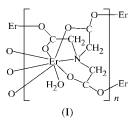
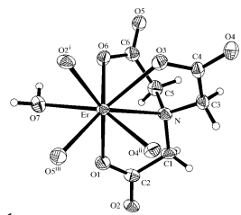
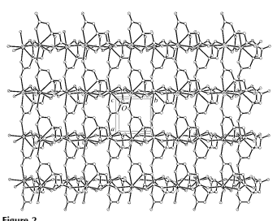
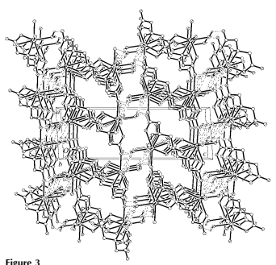

Acta Crystallographica Section C
Crystal Structure Communications ISSN 0108-2701

# Polymeric Aqua(Nitrilotriacetato)- Erbium(Iii)

Chuan-De Wu, Can-Zhong Lu,* Hong-Hui Zhuang and Jin-Shun Huang State Key Laboratory of Structural Chemistry, Fujian Institute of Research on the Structure of Matter, Chinese Academy of Sciences, Fuzhou, Fujian 350002, People's Republic of China Correspondence e-mail: czlu@ms.fjirsm.ac.cn Received 18 February 2002 Accepted 11 March 2002 Online 11 April 2002 In the structure of the title compound, [Er(C6H6NO6)(H2O)]n, the Er atoms are eight-coordinated by one N atom and six O atoms from three symmetry-related nitrilotriacetate (NTA) ligands, and by one O atom of a water molecule, adopting a distorted square-antiprismatic geometry. The Er atoms are linked by the NTA ligands into layers, which are interconnected via OÐHO hydrogen bonds between the water molecules and the carboxylate O atoms. The asymmetric unit contains one Er atom, one NTA ligand and one water molecule, all of which are located in general positions.

## Comment

Owing to the enormous variety of intriguing structural topologies, much effort has been devoted to researching novel coordination materials using multidentate organic ligands to coordinate to metal centres (Philp & Stoddard, 1996; Yaghi et al., 1998; Hagrman et al., 1999). The higher coordination numbers of lanthanide ions and the inherent ¯exibility of their coordination geometries might lead to some unprecedented topological architectures (Long et al., 2000, 2001; Pan et al., 2000). We are currently interested in pursuing synthetic strategies using lanthanide ions as nodes in the construction of polymeric frameworks. The nitrilotriacetate (NTA) ligand, which has six O atoms and one N atom as potential donors, is a

 rather versatile ligand for the synthesis of polymeric complexes containing lanthanide cations. To date, it is known that the NTA ligand may form at least three kinds of complexes with lanthanide elements, such as mononuclear cluster anions (Belyaeva et al., 1974; Starynowicz, 1987; Chen et al., 1989), polymeric complexes (Belyaeva et al., 1968; Martin & Jacobson, 1972a,b) and heterometallic polymers (Liu et al., 2000). As part of our investigations of new polycarboxylic-acid-bridged polymeric complexes, the title complex, [Er(C6H6NO6)(H2O)]n, (I), was obtained as red crystals and its structure is presented here.

Compound (I) has a two-dimensional framework that is built up by connecting the crystallographically unique ErIII
atom with its neighbours through bridging NTA ligands. For each NTA ligand, the N atom and one of the two O atoms in each carboxylate group coordinate to the same ErIII atom. The remaining three carboxylate O atoms in each ligand coordinate to three adjacent symmetry-related ErIII atoms. Six acetate O atoms, one N atom and one water ligand form a distorted square-antiprismatic coordination sphere about each metal centre (Fig. 1). The ErÐN distance is about 0.24 AÊ
longer than the average length of an ErÐO(carboxylate)
Figure 1

 A perspective view of the locally expanded unit for (I). Displacement ellipsoids are drawn at the 50% probability level and H atoms are shown as small spheres of arbitrary radii [symmetry codes: (i) x ÿ 1, y, z; (ii) 12 ÿ x, y ÿ 12, 12 ÿ z; (iii) x, y ÿ 1, z].

Figure 2
The crystal packing viewed down the c axis, showing the extended lamellar structure of (I). H atoms have been omitted for clarity.

The crystal packing in (I) viewed down the b axis. Hydrogen bonding is indicated by dashed lines. For clarity, H atoms on C atoms have been omitted.

bond. The latter bonds show little variation, due to the similar coordination mode of the carboxylate groups (Table 1). The length of the ErÐO bond involving the water ligand is similar to the ErÐO distances involving the carboxylate groups.

Each NTA ligand acts as a bridging ligand, connecting four ErIII ions into a two-dimensional structure (Fig. 2). The twodimensional polymer of (I) can be described as a trilayer. As shown in Fig. 3, all of the C, H and N atoms are in the middle `layer', while the two covering `sheets' are eight-coordinated ErIII centres, with all of the water ligands oriented to the outside of the trilayer. Furthermore, all of these trilayers are linked together through weak hydrogen bonding between the water ligands and the carboxylate O atoms of the NTA ligands, thus producing a three-dimensional framework in which the mean OO hydrogen-bonding distance is 2.942 (9) AÊ .

Compared with the previously reported three-dimensional polymeric complexes [Ln(NTA)(H2O)2] (Ln is Nd, Pr or Dy; Belyaeva et al., 1968; Martin & Jacobson, 1972a,b), the replacement of one water ligand by one NTA carboxylate O atom causes the structure of (I) to become a two-dimensional lamellar structure. The difference results from the different coordination mode of the NTA ligand in (I), which prevents it from making the additional connections required to build a three-dimensional framework. This also suggests that the products obtained under hydrothermal reaction conditions are quite different from those obtained from syntheses conducted at room temperature.

## Experimental

The pH of a mixture of ErCl3 [1.0 mmol, prepared from Er2O3
(0.191 g) dissolved in 35% HCl] and nitrilotriacetic acid (0.19 g, 1.0 mmol) in H2O (18 ml) was adjusted to 4.96 with 10% NH3H2O
under vigorous stirring. The reaction mixture was then heated at 443 K for 6 d under autogeneous pressure in a sealed 25 ml Te¯onlined stainless steel vessel. The reaction solution was cooled gradually and washed with water and ethanol, whereupon red crystals of (I)
were isolated. Spectroscopic analysis, IR (solid KBr pellet, , cmÿ1):
1599 (s), 1468 (m), 1429 (s), 1396 (m), 1338 (m), 1315 (s), 1300 (m), 1228 (m), 1132 (m), 1117 (m), 1024 (s), 991 (m), 970 (m).

| [Er(C6H6NO6)(H2O)]   |
|----------------------|
| Mr = 373.39          |
| Monoclinic, P21=n    |
| a = 6.7262 (6) AÊ    |
| b = 6.5427 (4) AÊ    |
| c = 19.800 (2) AÊ    |
| = 93.444 (4)                      |
| V = 869.8 (1) AÊ 3   |
| Z = 4                |

Crystal data Data collection Bruker SMART CCD area-detector diffractometer
' and ! scans Absorption correction: empirical
(SADABS; Sheldrick, 1996) Tmin = 0.328, Tmax = 0.560 2640 measured re¯ections

| Re®nement on F2                | 2  w = 1/[2 (Fo 2 ) + (0.0119P)                                   |
|--------------------------------|-----------------------------------|
| R[F2 > 2(F2 )] = 0.032                                | + 12.9152P]                       |
| wR(F2 ) = 0.072                | where P = (Fo  2 + 2Fc 2 )/3      |
| S = 1.09                       | (/)max  < 0.001                                   |
| 1520 re¯ections                | = 0.83 e AÊ ÿ3  max                                   |
| 137 parameters                 | min  = ÿ1.04 e AÊ ÿ3                                   |
| H\-atom parameters constrained | Extinction correction: SHELXL97   |
|                                | (Sheldrick, 1997)                 |
|                                | Extinction coef®cient: 0.0110 (5) |

| 1520 independent re¯ections   |
|-------------------------------|
| 1340 re¯ections with I > 2(I)                               |
| Rint = 0.033                  |
| max  = 25.1                               |
| h = ÿ5 ! 7                    |
| k = ÿ7 ! 5                    |
| l = ÿ23 ! 23                  |

| ErÐO1                                     | 2.336 (6)         | ErÐO5iii                | 2.309 (6)   |
|-------------------------------------------|-------------------|-------------------------|-------------|
| ErÐO2i                                    | 2.359 (6)         | ErÐO6                   | 2.312 (6)   |
| ErÐO3                                     | 2.373 (6)         | ErÐO7                   | 2.343 (6)   |
| ErÐO4ii                                   | 2.310 (6)         | ErÐN                    | 2.575 (7)   |
| O4iiÐErÐO1                                | 86.3 (2)          | O5iiiÐErÐO4ii           | 75.8 (2)    |
| O5iiiÐErÐO1                               | 81.7 (2)          | O4iiÐErÐO6              | 139.2 (2)   |
| O6ÐErÐO1                                  | 100.3 (2)         | O5iiiÐErÐO6             | 144.8 (2)   |
| O1ÐErÐO2i                                 | 151.1 (2)         | O1ÐErÐO7                | 78.7 (2)    |
| O4iiÐErÐO2i                               | 105.4 (2)         | O4iiÐErÐO7              | 147.9 (2)   |
| O5iiiÐErÐO2i                              | 75.9 (2)          | O5iiiÐErÐO7             | 74.1 (2)    |
| O6ÐErÐO2i                                 | 88.1 (2)          | O6ÐErÐO7                | 71.9 (2)    |
| O7ÐErÐO2i                                 | 77.7 (2)          | O1ÐErÐN                 | 66.2 (2)    |
| O1ÐErÐO3                                  | 130.5 (2)         | O2i ÐErÐN               | 141.8 (2)   |
| O2i ÐErÐO3                                | 78.5 (2)          | O3ÐErÐN                 | 65.3 (2)    |
| O4iiÐErÐO3                                | 73.2 (2)          | O4iiÐErÐN               | 76.3 (2)    |
| O5iiiÐErÐO3                               | 132.4 (2)         | O5iiiÐErÐN              | 138.4 (2)   |
| O6ÐErÐO3                                  | 72.1 (2)          | O6ÐErÐN                 | 70.2 (2)    |
| O7ÐErÐO3                                  | 137.1 (2)         | O7ÐErÐN                 | 121.3 (2)   |
| Symmetry codes: (i) x ÿ 1; y; z; (ii) 1 2 | ÿ x; y ÿ 1 2; 1 2 | ÿ z; (iii) x; y ÿ 1; z. |             |

Re®nement H atoms on C atoms were generated geometrically. The H atoms of the water ligand were clearly visible in difference maps, and these were placed in the difference map positions and constrained to ride on their parent O atom. All H atoms were assigned ®xed isotropic displacement parameters, with Uiso(H) = 1.2Ueq(parent atom). The ÿ1.04 e AÊ ÿ3 hole in the ®nal difference map is 0.83 AÊ from the Er atom.

| Dx = 2.852 Mg mÿ3        |
|--------------------------|
| Mo K radiation                          |
| Cell parameters from 920 |
| re¯ections               |
|  = 2.1±25.1                          |
|  = 9.67 mmÿ1                          |
| T = 293 (2) K            |
| Prism, red               |
| 0.16  0.08  0.06 mm                          |

Table 1 Selected geometric parameters (AÊ , ).

#### Table 2

Hydrogen-bonding geometry (AÊ , ).

| DÐHA   | DÐH   | HA      | DA           | DÐHA     |
|---|-------|------|-----------|-----|
| O7ÐH7BO2i   | 0.90  | 2.30 | 2.983 (8) | 133 |
| O7ÐH7BO5ii   | 0.90  | 2.15 | 2.912 (9) | 142 |
| O7ÐH7AO6ii   | 0.82  | 2.42 | 2.932 (9) | 122 |

Symmetry codes: (i) 1 ÿ x; ÿy; ÿz; (ii) ÿx; 1 ÿ y; ÿz.

Data collection: SMART (Siemens, 1996); cell re®nement: SMART
and SAINT (Siemens, 1994); data reduction: SMART and SAINT; program(s) used to solve structure: SHELXS97 (Sheldrick, 1997); program(s) used to re®ne structure: SHELXL97 (Sheldrick, 1997); molecular graphics: SHELXTL (Siemens, 1994); software used to prepare material for publication: SHELXL97.

We gratefully thank the Chinese Academy of Sciences, the State Education Ministry, the NSF of Fujian and the NSFC (20073048) for ®nancial support.

Supplementary data for this paper are available from the IUCr electronic archives (Reference: LN1137). Services for accessing these data are described at the back of the journal.

# Metal-Organic Compounds

## References

Belyaeva, K. F., Porai-Koshits, M. A. & Malinovskii, T. I. (1974). Eur.

Crystallogr. Meet. p. 346.

Belyaeva, K. F., Porai-Koshits, M. A., Mitrofanova, N. D. & Martynenko, L. I.

(1968). Zh. Strukt. Khim. 9, 541±543. (In Russian.)
Chen, S., Liu, Z. & Li, D. (1989). Huaxue Xuebao, 47, 428±433. (In Chinese.) Hagrman, P. J., Hagrman, D. & Zubieta, J. (1999). Angew. Chem. Int. Ed. 38, 2638±2684.

Liu, Q.-D., Li, J.-R., Gao, S., Ma, B.-Q., Zhou, Q.-Z., Yu, K.-B. & Liu, H.

(2000). Chem. Commun. pp. 1685±1686.

Long, D.-L., Blake, A. J., Champness, N. R. & SchroÈder, M. (2000). Chem.

Commun. pp. 1369±1370.

Long, D.-L., Blake, A. J., Champness, N. R., Wilson, C. & SchroÈder, M. (2001).

Angew. Chem. Int. Ed. 40, 2443±2447.

Martin, L. L. & Jacobson, R. A. (1972a). Inorg. Chem. 11, 2785±2789. Martin, L. L. & Jacobson, R. A. (1972b). Inorg. Chem. 11, 2789±2795. Pan, L., Woodlock, E. B., Wang, X. & Zheng, C. (2000). Inorg. Chem. 39, 4174±
4178.

Philp, D. & Stoddart, J. F. (1996). Angew. Chem. Int. Ed. Engl. 35, 1154±1196. Sheldrick, G. M. (1996). SADABS. University of GoÈttingen, Germany. Sheldrick, G. M. (1997). SHELXS97 and SHELXL97. University of GoÈttingen, Germany.

Siemens (1994). SAINT (Version 4.0) and SHELXTL (Version 5.03). Siemens Analytical X-ray Instruments Inc., Madison, Wisconsin, USA.

Siemens (1996). SMART. Version 4.0. Siemens Analytical X-ray Instruments Inc., Madison, Wisconsin, USA.

Starynowicz, P. (1987). Acta Cryst. C43, 1509±1511. Yaghi, O. M., Li, H., Davis, C., Richardson, D. & Groy, T. L. (1998). Acc. Chem.

Res. 31, 474±484.

# Supporting Information

Acta Cryst. (2002). C58, m283–m285 [doi:10.1107/S010827010200464X]
Polymeric aqua(nitrilotriacetato)erbium(III)
Chuan-De Wu, Can-Zhong Lu, Hong-Hui Zhuang and Jin-Shun Huang Computing details Data collection: *SMART* (Siemens, 1996); cell refinement: *SMART and SAINT* (Siemens, 1994); data reduction: *SMART* and *SAINT*; program(s) used to solve structure: *SHELXS97* (Sheldrick, 1997); program(s) used to refine structure: SHELXL97 (Sheldrick, 1997); molecular graphics: *SHELXTL* (Siemens, 1994); software used to prepare material for publication: *SHELXL97*. Polymeric aqua(nitrilotriacetato)erbium(III) 

| Crystal data                                     |                                                  |
|--------------------------------------------------|--------------------------------------------------|
| [Er(C6H6NO6)(H2O)]                               | F(000) = 700                                     |
| Mr = 373.39                                      | Dx = 2.852 Mg m−3                                |
| Monoclinic, P21/n                                | Mo Kα radiation, λ = 0.71073 Å                   |
| a = 6.7262 (6) Å                                 | Cell parameters from 920 reflections             |
| b = 6.5427 (4) Å                                 | θ = 2.1–25.1°                                    |
| c = 19.800 (2) Å                                 | µ = 9.67 mm−1                                    |
| β = 93.444 (4)°                                  | T = 293 K                                        |
| V = 869.8 (1) Å3                                 | Prism, red                                       |
| Z = 4                                            | 0.16 × 0.08 × 0.06 mm                            |
| Data collection                                  |                                                  |
| Bruker SMART CCD area\-detector                  | 2640 measured reflections                        |
| diffractometer                                   | 1520 independent reflections                     |
| Radiation source: fine\-focus sealed tube        | 1340 reflections with I > 2σ(I)                  |
| Graphite monochromator                           | Rint = 0.033                                     |
| φ and ω scans                                    | θmax = 25.1°, θmin = 2.1°                        |
| Absorption correction: empirical (using          | h = −5→7                                         |
| intensity measurements)                          | k = −7→5                                         |
| (SADABS; Sheldrick, 1996)                        | l = −23→23                                       |
| Tmin = 0.328, Tmax = 0.560                       |                                                  |
| Refinement                                       |                                                  |
| Refinement on F2                                 | Secondary atom site location: difference Fourier |
| Least\-squares matrix: full                      | map                                              |
| R[F2  > 2σ(F2 )] = 0.032                         | Hydrogen site location: inferred from            |
| wR(F2 ) = 0.072                                  | neighbouring sites                               |
| S = 1.09                                         | H\-atom parameters constrained                   |
| 1520 reflections                                 | w = 1/[σ2 (Fo 2 ) + (0.0119P) 2  + 12.9152P]     |
| 137 parameters                                   | where P = (Fo 2  + 2Fc 2 )/3                     |
| 0 restraints                                     | (Δ/σ)max < 0.001                                 |
| Primary atom site location: structure\-invariant | Δρmax = 0.83 e Å−3                               |
| direct methods                                   | Δρmin = −1.04 e Å−3                              |

Extinction correction: *SHELXL97* (Sheldrick, 1997), Fc*=kFc[1+0.001xFc2λ3/sin(2θ)]-1/4 Extinction coefficient: 0.0110 (5)

## Special Details

Geometry. All e.s.d.'s (except the e.s.d. in the dihedral angle between two l.s. planes) are estimated using the full covariance matrix. The cell e.s.d.'s are taken into account individually in the estimation of e.s.d.'s in distances, angles and torsion angles; correlations between e.s.d.'s in cell parameters are only used when they are defined by crystal symmetry. An approximate (isotropic) treatment of cell e.s.d.'s is used for estimating e.s.d.'s involving l.s. planes.

Refinement. Refinement of F2 against ALL reflections. The weighted R-factor wR and goodness of fit S are based on F2, conventional R-factors R are based on F, with F set to zero for negative F2. The threshold expression of F2 > σ(F2) is used only for calculating R-factors(gt) etc. and is not relevant to the choice of reflections for refinement. R-factors based on F2 are statistically about twice as large as those based on F, and R- factors based on ALL data will be even larger.

Fractional atomic coordinates and isotropic or equivalent isotropic displacement parameters (Å2)

|     | x           | y           | z             | Uiso*/Ueq    |
|-----|-------------|-------------|---------------|--------------|
| Er  | 0.23184 (5) | 0.23483 (5) | 0.104751 (17) | 0.01708 (19) |
| O1  | 0.5554 (9)  | 0.1790 (10) | 0.0721 (3)    | 0.0291 (14)  |
| O2  | 0.8855 (8)  | 0.1769 (9)  | 0.0918 (3)    | 0.0271 (13)  |
| O3  | 0.1142 (9)  | 0.4405 (10) | 0.1927 (3)    | 0.0276 (14)  |
| O4  | 0.1656 (9)  | 0.5791 (9)  | 0.2944 (3)    | 0.0273 (14)  |
| O5  | 0.2049 (10) | 0.8897 (9)  | 0.0817 (3)    | 0.0310 (15)  |
| O6  | 0.1748 (9)  | 0.5596 (9)  | 0.0618 (3)    | 0.0261 (13)  |
| O7  | 0.1781 (9)  | 0.2084 (9)  | −0.0129 (3)   | 0.0282 (13)  |
| H7A | 0.1576      | 0.3224      | −0.0291       | 0.034*       |
| H7B | 0.0875      | 0.1206      | −0.0315       | 0.034*       |
| N   | 0.4906 (10) | 0.4853 (11) | 0.1587 (4)    | 0.0230 (15)  |
| C1  | 0.6957 (12) | 0.3993 (14) | 0.1572 (5)    | 0.028 (2)    |
| H1A | 0.7326      | 0.3374      | 0.2007        | 0.033*       |
| H1B | 0.7887      | 0.5094      | 0.1500        | 0.033*       |
| C2  | 0.7122 (12) | 0.2421 (12) | 0.1025 (4)    | 0.0235 (18)  |
| C3  | 0.4438 (13) | 0.5275 (15) | 0.2284 (4)    | 0.0266 (19)  |
| H3A | 0.4934      | 0.6623      | 0.2409        | 0.032*       |
| H3B | 0.5129      | 0.4292      | 0.2579        | 0.032*       |
| C4  | 0.2283 (13) | 0.5187 (12) | 0.2395 (4)    | 0.0227 (19)  |
| C5  | 0.4784 (13) | 0.6706 (13) | 0.1159 (5)    | 0.0285 (19)  |
| H5A | 0.5686      | 0.6558      | 0.0798        | 0.034*       |
| H5B | 0.5222      | 0.7875      | 0.1430        | 0.034*       |
| C6  | 0.2723 (14) | 0.7115 (13) | 0.0854 (4)    | 0.0268 (19)  |

|    | U11        | U22        | U33        | U12          | U13          | U23           |
|----|------------|------------|------------|--------------|--------------|---------------|
| Er | 0.0157 (2) | 0.0137 (2) | 0.0217 (2) | 0.00028 (14) | 0.00030 (13) | −0.00050 (14) |
| O1 | 0.018 (3)  | 0.033 (3)  | 0.036 (3)  | 0.002 (3)    | 0.000 (3)    | −0.009 (3)    |
| O2 | 0.017 (3)  | 0.026 (3)  | 0.040 (3)  | 0.002 (3)    | 0.005 (3)    | −0.007 (3)    |
| O3 | 0.020 (3)  | 0.034 (4)  | 0.029 (3)  | 0.001 (3)    | 0.000 (2)    | −0.004 (3)    |
| O4 | 0.028 (3)  | 0.029 (3)  | 0.025 (3)  | −0.006 (3)   | −0.002 (3)   | −0.003 (3)    |
| O5 | 0.039 (4)  | 0.020 (3)  | 0.033 (3)  | 0.002 (3)    | −0.008 (3)   | 0.001 (3)     |

Atomic displacement parameters (Å2)
supporting information

| O6   | 0.035 (4)   | 0.016 (3)   | 0.026 (3)   | 0.000 (3)   | −0.009 (3)   | 0.003 (2)   |
|------|-------------|-------------|-------------|-------------|--------------|-------------|
| O7   | 0.030 (3)   | 0.027 (3)   | 0.028 (3)   | −0.003 (3)  | 0.004 (3)    | −0.003 (3)  |
| N    | 0.016 (3)   | 0.023 (4)   | 0.030 (4)   | 0.000 (3)   | 0.003 (3)    | −0.005 (3)  |
| C1   | 0.016 (4)   | 0.025 (4)   | 0.042 (5)   | 0.005 (3)   | −0.004 (4)   | −0.006 (4)  |
| C2   | 0.017 (4)   | 0.022 (4)   | 0.032 (5)   | −0.001 (4)  | 0.008 (4)    | 0.001 (4)   |
| C3   | 0.021 (4)   | 0.033 (5)   | 0.026 (4)   | 0.000 (4)   | −0.002 (4)   | −0.011 (4)  |
| C4   | 0.036 (5)   | 0.016 (4)   | 0.016 (4)   | 0.000 (4)   | −0.001 (4)   | 0.002 (3)   |
| C5   | 0.028 (5)   | 0.023 (4)   | 0.034 (5)   | −0.007 (4)  | 0.001 (4)    | −0.003 (4)  |
| C6   | 0.035 (5)   | 0.019 (5)   | 0.026 (4)   | 0.001 (4)   | 0.001 (4)    | 0.001 (3)   |

| Er—O1         | 2.336 (6)   | O7—H7A     | 0.8200     |
|---------------|-------------|------------|------------|
| Er—O2i        | 2.359 (6)   | O7—H7B     | 0.9000     |
| Er—O3         | 2.373 (6)   | N—C3       | 1.459 (11) |
| Er—O4ii       | 2.310 (6)   | N—C5       | 1.479 (11) |
| Er—O5iii      | 2.309 (6)   | N—C1       | 1.492 (10) |
| Er—O6         | 2.312 (6)   | C1—C2      | 1.502 (11) |
| Er—O7         | 2.343 (6)   | C1—H1A     | 0.9700     |
| Er—N          | 2.575 (7)   | C1—H1B     | 0.9700     |
| O1—C2         | 1.253 (10)  | C3—C4      | 1.480 (12) |
| O2—C2         | 1.271 (10)  | C3—H3A     | 0.9700     |
| O3—C4         | 1.275 (10)  | C3—H3B     | 0.9700     |
| O4—C4         | 1.254 (10)  | C5—C6      | 1.502 (13) |
| O5—C6         | 1.252 (10)  | C5—H5A     | 0.9700     |
| O6—C6         | 1.264 (10)  | C5—H5B     | 0.9700     |
| O4ii—Er—O1    | 86.3 (2)    | Er—O7—H7B  | 121.0      |
| O5iii—Er—O1   | 81.7 (2)    | H7A—O7—H7B | 109.1      |
| O6—Er—O1      | 100.3 (2)   | C3—N—C5    | 112.3 (7)  |
| O1—Er—O2i     | 151.1 (2)   | C3—N—C1    | 110.0 (7)  |
| O4ii—Er—O2i   | 105.4 (2)   | C5—N—C1    | 108.5 (7)  |
| O5iii—Er—O2i  | 75.9 (2)    | C3—N—Er    | 109.5 (5)  |
| O6—Er—O2i     | 88.1 (2)    | C5—N—Er    | 105.7 (5)  |
| O7—Er—O2i     | 77.7 (2)    | C1—N—Er    | 110.7 (5)  |
| O1—Er—O3      | 130.5 (2)   | N—C1—C2    | 112.4 (7)  |
| O2i —Er—O3    | 78.5 (2)    | N—C1—H1A   | 109.1      |
| O4ii—Er—O3    | 73.2 (2)    | C2—C1—H1A  | 109.1      |
| O5iii—Er—O3   | 132.4 (2)   | N—C1—H1B   | 109.1      |
| O6—Er—O3      | 72.1 (2)    | C2—C1—H1B  | 109.1      |
| O7—Er—O3      | 137.1 (2)   | H1A—C1—H1B | 107.9      |
| O5iii—Er—O4ii | 75.8 (2)    | O1—C2—O2   | 124.3 (8)  |
| O4ii—Er—O6    | 139.2 (2)   | O1—C2—C1   | 118.4 (7)  |
| O5iii—Er—O6   | 144.8 (2)   | O2—C2—C1   | 117.3 (7)  |
| O1—Er—O7      | 78.7 (2)    | N—C3—C4    | 113.7 (7)  |
| O4ii—Er—O7    | 147.9 (2)   | N—C3—H3A   | 108.8      |
| O5iii—Er—O7   | 74.1 (2)    | C4—C3—H3A  | 108.8      |
| O6—Er—O7      | 71.9 (2)    | N—C3—H3B   | 108.8      |

Geometric parameters (Å, º)
supporting information

| O1—Er—N    | 66.2 (2)   | C4—C3—H3B   | 108.8     |
|------------|------------|-------------|-----------|
| O2i —Er—N  | 141.8 (2)  | H3A—C3—H3B  | 107.7     |
| O3—Er—N    | 65.3 (2)   | O4—C4—O3    | 122.5 (8) |
| O4ii—Er—N  | 76.3 (2)   | O4—C4—C3    | 120.0 (7) |
| O5iii—Er—N | 138.4 (2)  | O3—C4—C3    | 117.4 (7) |
| O6—Er—N    | 70.2 (2)   | N—C5—C6     | 113.2 (7) |
| O7—Er—N    | 121.3 (2)  | N—C5—H5A    | 108.9     |
| C2—O1—Er   | 125.9 (5)  | C6—C5—H5A   | 108.9     |
| C2—O2—Eriv | 146.9 (6)  | N—C5—H5B    | 108.9     |
| C4—O3—Er   | 123.2 (5)  | C6—C5—H5B   | 108.9     |
| C4—O4—Erv  | 142.2 (6)  | H5A—C5—H5B  | 107.7     |
| C6—O5—Ervi | 151.1 (6)  | O5—C6—O6    | 122.2 (8) |
| C6—O6—Er   | 121.0 (5)  | O5—C6—C5    | 120.8 (8) |
| Er—O7—H7A  | 109.5      | O6—C6—C5    | 117.0 (8) |

Symmetry codes: (i) x−1, y, z; (ii) −x+1/2, y−1/2, −z+1/2; (iii) *x, y*−1, z; (iv) x+1, y, z; (v) −x+1/2, y+1/2, −z+1/2; (vi) x, y+1, z.

| D—H···A         | D—H   | H···A   | D···A     | D—H···A   |
|-----------------|-------|---------|-----------|-----------|
| O7—H7B···O2vii  | 0.90  | 2.30    | 2.983 (8) | 133       |
| O7—H7B···O5viii | 0.90  | 2.15    | 2.912 (9) | 142       |
| O7—H7A···O6viii | 0.82  | 2.42    | 2.932 (9) | 122       |

Hydrogen-bond geometry (Å, º)
Symmetry codes: (vii) −x+1, −y, −z; (viii) −x, −y+1, −z.