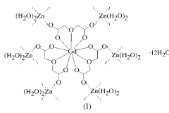
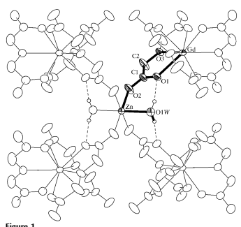
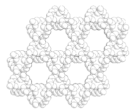

Acta Crystallographica Section C
Crystal Structure Communications ISSN 0108-2701

# Polymeric Hexaaquahexakis- (L3-2,20-Oxydiacetato)Trizinc(Ii)- Digadolinium(Iii) Dodecahydrate

Ricardo Baggio,a* Mireille Perecb and Maria Teresa Garlandc aDepartamento de FõÂsica, ComisioÂn Nacional de EnergõÂa AtoÂmica, Buenos Aires, Argentina, bDepartamento de QuõÂmica InorgaÂnica, AnalõÂtica y QuõÂmica FõÂsica, INQUIMAE, Facultad de Ciencias Exactas y Naturales, UNBA, Buenos Aires, Argentina, and cDepartamento de FõÂsica, Facultad de Ciencias FõÂsicas y MatemaÂticas, Universidad de Chile, Casilla 487-3, Santiago de Chile, Chile Correspondence e-mail: baggio@cnea.gov.ar Received 17 February 2003 Accepted 14 March 2003 Online 10 April 2003 A polymeric heterometallic compound, {[Gd2Zn3(C4H4O5)6-
(H2O)6]12H2O}n, comprising zinc(II) and gadolinium(III)
cations bridged by carboxylate groups from oxydiacetate ligands, is presented. The GdIII cations lie at sites with crystallographic 32 symmetry and display a tricapped trigonalprism arrangement, which is de®ned by six carboxyl and three ether O atoms. The ZnII cations lie at sites with imposed 2/m symmetry and are octahedrally coordinated by four carboxyl O atoms and two apical water ligands, which form strong intramolecular hydrogen bonds. Comparison is made with the previously reported isostructural homologous copper±gadolinium complex.

## Comment

The design of new compounds with speci®c architectures is a rapidly developing ®eld in modern inorganic chemistry. One successful strategy is based on the use of both the buildingbonding approach and the hydrogen-bonding capability of the ligands (Lehn, 1995). The oxydiacetate anion (oda) is a well known and versatile ligand that is able to chelate and bridge metal ions in a variety of ways, leading to the formation of polynuclear and low-dimensional systems (Grirrane et al., 2002). We have recently reported the study of a series of oxydiacetate-bridged copper(II)±lanthanide(III) threedimensional polymers, formulated as {[Cu3Ln2(oda)6-
(H2O)6]12H2O}n [Ln = Y, Gd, Eu, Nd and Pr (Baggio et al.,
2000); Ln = Dy, Ho, Er and Y (Rizzi et al., 2002)]. These polymers crystallize in the hexagonal system, with space group P6/mcc (No. 192). Replacement of copper by zinc ions to obtain isostructural zinc±lanthanide compounds appears possible, in principle, in spite of the lack of crystal-®eld stabilization of the ZnII cation. Such compounds should be of interest in the study of magnetic exchange interactions between lanthanide ions, since ZnII has no unpaired electrons.

The ®rst Zn±Gd compound bridged by carboxylate groups has been reported for the propionate derivative [Zn2Gd2- (O2CC2H5)8(C9H7N)2(NO3)2(H2O)2] (Cui et al., 2001). The structure consists of two triply propionate-bridged dinuclear Zn±Gd subunits, linked together by two tridentate propionate groups bridging the neighboring GdIII ions. We report here the isolation and X-ray structure of the title compound, (I). The crystallographic results reveal that the Zn±Gd complex is isostructural with the other members of the copper±lanthanide series, in particular the Cu±Gd member, (II).

The structure of (I) consists of two distinct types of building

block, viz. GdO9 and ZnO6, as illustrated in Fig. 1. Two GdO9 and three ZnO6 cores form the unit cell that generates an extended, highly symmetric, three-dimensional structure. The Gd atom lies at the intersection of a three- and a twofold axis and is coordinated by the carboxylate O1 and O10 atoms (where the prime denotes the twofold-related part of the oda ligand) and by the ether O3 atoms of three symmetry-related oda ligands [GdÐOcarboxyl = 2.402 (2) AÊ and GdÐOether = 2.475 (3) AÊ ; Table 1], leading to the usual tricapped trigonalprismatic geometry (TCTP; Albertsson, 1968). The gadoli-

Figure 1
The molecular structure of (I), showing the way in which the threedimensional network forms. Intramolecular hydrogen bonds are represented by dashed lines. Displacement ellipsoids are shown at the 40%
probability level.

Figure 2 Space-®lling diagram of the structure of (I), viewed along the z axis. Note the columnar voids where the disordered water molecules reside.

Projections of the hexagonal unit-cell nodes lie at the void centers.

nium coordination polyhedron is similar to that found in (II), to the extent that a superposition of the two entities (XP in SHELXTL; Bruker, 1999) matched within an average deviation of less than 0.045 AÊ .

Each Zn atom lies at the intersection of a twofold axis and a mirror plane, and is coordinated by the outer carboxylate O2 and O20 atoms of four oda ligands [ZnÐObasal = 2.052 (2) AÊ ],
which de®ne the equatorial plane. The apical sites are occupied by two water molecules at a ZnÐO distance of 2.152 (1) AÊ , similar to the basal bonds. The geometries of the GdO9 and ZnO6 coordination polyhedra are unexceptional and their average bonding distances are similar to those obtained in a search for similarly coordinated cores in the Cambridge Structural Database (CSD; Allen, 2002); mean GdÐO and ZnÐO distances in the CSD (49 and 125 structures, respectively): 2.45 (8) and 2.10 (7) AÊ ; measured for (I): 2.43 (4) and 2.09 (5) AÊ .

The most noteworthy differences between (I) and (II) are found in the vicinity of the octahedral site, where the nearly isometric coordination of Zn in (I) contrasts with the strong Jahn±Teller distortion around copper in (II) [CuÐ
Obasal = 1.956 (4) AÊ and CuÐOapical = 2.519 (2) AÊ ]. These bond-length differences propagate through the connecting chains, linking the three-dimensional structure in such a way as to modify the cell constants by decreasing a by 1.4% and increasing c by 4.5% when replacing copper with zinc. Therefore, the corresponding ZnZn and GdGd separations have different values along different directions. Distances taken along the two-dimensional structures, nearly parallel to the apical OÐCuÐO bonds ([100], [010] and [110]), shrink, while distances taken normal to the twodimensional structures, almost along the diagonal of the basal coordination plane ([001]), expand when replacing Cu by Zn.

The intramolecular ZnGd separation of 5.753 (1) AÊ ,
however, is very similar to the corresponding CuGd distance in (II) [5.695 (1) AÊ ], because the interatomic vector is nearly parallel to the almost invariant [111] direction.

All the outer carboxylate O atoms link to Zn atoms, so that each Gd atom is surrounded by six Zn atoms as nearest neighbors, while the Zn atoms have four Gd atoms in their vicinity, as expected from the Zn/Gd molar relationship. Through this connectivity pattern, the Gd polyhedra create a two-dimensional planar honeycomb structure, parallel to
(001), at z heights of 14 and 34. Each pair of polyhedra at one side of the hexagonal motif is connected to the homologous pair one layer below (above) via a Zn atom bonded to four outer carboxylate O atoms (two from above and two from below). As a result of the translational symmetry along z, the two-dimensional structure develops into a three-dimensional honeycomb structure with columnar voids with a diameter of almost 6 AÊ (Fig. 2). These, in turn, are occupied by a number of highly disordered water molecules. Their interaction with the main structure could not be studied, since the H atoms of the water molecules were not found. On the other hand, the only independent water H atom in the zinc coordination sphere binds strongly to atom O1 of the ligand, and this H atom was clearly resolved in a difference Fourier map (Table 2).

In spite of the differences in their octahedral sites, the whole array in (I) is very similar to that found in (II), which suggests that ZnII can replace the CuII ions in the octahedral CuO6 sites in the Cu±Ln system, leading to an isomorphous Zn±Ln series. This could be useful in understanding the electronic and magnetic properties of these extended solids.

## Experimental

Chemicals for the synthesis of (I) were used as purchased (reagent grade) without further puri®cation. Zinc acetate dihydrate (0.35 g, 1.5 mmol) and gadolinium acetate hydrate (0.35 g, 1 mmol) were dissolved in an aqueous solution (25 ml) of oxydiacetic acid (0.60 g, 4.5 mmol) and stirred at room temperature for 4 h. After a few weeks, colorless crystals of the compound suitable for X-ray diffraction were ®ltered off and dried in air.

#### Crystal Data

| [Zn3Gd2(C4H4O5)6(H2O)6]12H2O                                  | Mo K radiation                             |
|----------------------------------|-----------------------------|
| Mr  = 1627.33                    | Cell parameters from 15 357 |
| Hexagonal, P6=mcc                | re¯ections                  |
| a = 14.5104 (11) AÊ              |  = 1.6±28.0                             |
| c = 15.7725 (16) AÊ              |  = 3.62 mmÿ1                             |
| V = 2876.0 (4) AÊ 3              | T = 293 (2) K               |
| Z = 2                            | Polyhedra, colorless        |
| Dx = 1.879 Mg mÿ3                | 0.32  0.30  0.22 mm                             |
| Data collection                  |                             |
| Bruker SMART CCD 1K area                                  | 1180 independent re¯ections |
| detector diffractometer          | 962 re¯ections with I > 2(I)                             |
| ! scans                          | Rint = 0.091                |
| Absorption correction: empirical | max = 28.0                             |
| (XPREP in SHELXTL;               | h = ÿ18 ! 15                |
| Bruker, 1999)                    | k = ÿ17 ! 18                |
| Tmin = 0.35, Tmax = 0.47         | l = ÿ20 ! 19                |
| 15 357 measured re¯ections       |                             |

Table 1

| GdÐO1   | 2.402 (2)   | O1ÐC1   | 1.259 (4)   |
|---------|-------------|---------|-------------|
| GdÐO3   | 2.475 (3)   | O2ÐC1   | 1.246 (3)   |
| ZnÐO2   | 2.052 (2)   | O3ÐC2   | 1.390 (4)   |
| ZnÐO1W  | 2.152 (3)   | C1ÐC2   | 1.488 (4)   |

Selected bond lengths (AÊ ).

| Table 2  Hydrogen\-bonding geometry (AÊ ,   |          | ).          |           |         |
|---------------------------------------------|----------|----------|-----------|---------|
| DÐHA                                             | DÐH      | HA          | DA           | DÐHA         |
| O1WÐH1WO1i                                             | 0.88 (5) | 1.90 (5) | 2.768 (3) | 167 (4) |
| Symmetry code: (i) x; y; 1 ÿ z.             |          |          |           |         |

| Re®nement on F2   | H atoms treated by a mixture of   |
|-------------------|-----------------------------------|
| R[F2 > 2(F2 )] = 0.032                   | independent and constrained       |
| wR(F2 ) = 0.096   | re®nement                         |
| S = 1.07          | w = 1/[2 (F2 o) + (0.0556P) 2 + 0.947P]                                   |
| 1180 re¯ections   | where P = (F2 o + 2F2 c )/3       |
| 74 parameters     | (/)max = 0.007                                   |
|                   | max = 0.78 e AÊ ÿ3                                   |
|                   | min = ÿ0.72 e AÊ ÿ3                                   |

#### Re®Nement

The structure of the homologous copper±gadolinium complex was used as a starting model for re®nement by least squares on F2, using all data, with anisotropic displacement parameters for non-H atoms. H atoms belonging to the coordinated water molecules were found in the ®nal F synthesis and were fully re®ned with isotropic displacement parameters. H atoms attached to C atoms were included in calculated positions and allowed to ride. The water molecules appeared to be very disordered in the columnar cavities of the structure, and it was impossible to determine their overall number by X-ray techniques alone. Thermogravimetric analysis of freshly prepared samples showed a weight loss, m, of 19.6% (expected for 18 water molecules: 19.8%), of which 6.6% corresponds to the six water molecules and the rest (13.0%) corresponds to the remaining water of crystallization This remainder amounts to 11.8 (12) molecules per formula unit; only a fraction of these molecules (75%)
were found in a difference Fourier map and they appeared to be scattered into ®ve independent positions, with a total O-atom occupation of 8.9 (5). These molecules were re®ned with a common isotropic displacement parameter without their H atoms.

Data collection: SMART-NT (Bruker, 1999); cell re®nement:
SMART-NT; data reduction: SAINT-NT (Bruker, 1999); program(s) used to solve structure: XS in SHELXTL (Bruker, 1999); program(s) used to re®ne structure: XL in SHELXTL; molecular graphics: XP in SHELXTL; software used to prepare material for publication: XP in SHELXTL.

We thank the Spanish Research Council (CSIC) for providing a license to the CSD system. This work was partially supported by CONICYT FONDAP grant No. 11980002 and FONDECYT grant No. 1020802 (Chile). MP is a member of CONICET.

Supplementary data for this paper are available from the IUCr electronic archives (Reference: GA1010). Services for accessing these data are described at the back of the journal.

## References

Albertsson, J. (1968). Acta Chem. Scand. 22, 1563±1578. Allen, F. H. (2002). Acta Cryst. B58, 380±388. Baggio, R., Garland, M. T., Moreno, Y., PenÄ a, O., Perec, M. & Spodine, E.

(2000). J. Chem. Soc. Dalton Trans. pp. 2061±2066.

Bruker (1999). SMART-NT (Version 5.0), SAINT-NT (Version 5.0) and SHELXTL-NT (Version 5.1). Bruker AXS Inc., Madison, Wisconsin, USA.

Cui, Y., Zheng, F., Qian, Y. & Huang, J. (2001). Inorg. Chim. Acta, 315, 220±
228.

Grirrane, A., Pastor, A., Ienco, A., Mealli, C. & Galindo, A. (2002). J. Chem.

Soc. Dalton Trans. pp. 3771±3777.

Lehn, J.-M. (1995). In Supramolecular Chemistry: Concept and Perpectives.

Weinheim: VCH.

Rizzi, A., Calvo, R., Baggio, R., Garland, M. T., PenÄ a, O. & Perec, M. (2002).

Inorg. Chem. 41, 5609±5614.

# Supporting Information

Acta Cryst. (2003). C59, m175–m177 [doi:10.1107/S010827010300595X]
Polymeric hexaaquahexakis(µ3-2,2′-oxydiacetato)trizinc(II)digadolinium(III) 
dodecahydrate Ricardo Baggio, Mireille Perec and Maria Teresa Garland Computing details Data collection: *SMART-NT* (Bruker, 1999); cell refinement: *SMART-NT*; data reduction: *SAINT-NT* (Bruker, 1999); program(s) used to solve structure: XS in *SHELXTL* (Bruker, 1999); program(s) used to refine structure: XL in *SHELXTL* (Bruker, 1999); molecular graphics: *XP in SHELXTL* (Bruker, 1999); software used to prepare material for publication: XP in SHELXTL.

hexaaquahexakis(µ**3-2,2′-oxydiacetato)trizinc(II)digadolinium(III) dodecahydrate** 
Crystal data

| [Zn3Gd2(C4H4O5)6(H2O)6]·12H2O             | Dx = 1.879 Mg m−3                                |
|-------------------------------------------|--------------------------------------------------|
| Mr = 1627.33                              | Mo Kα radiation, λ = 0.71073 Å                   |
| Hexagonal, P6/mcc                         | Cell parameters from 15357 reflections           |
| Hall symbol: \-P 6 2c                     | θ = 1.6–28.0°                                    |
| a = 14.5104 (11) Å                        | µ = 3.62 mm−1                                    |
| c = 15.7725 (16) Å                        | T = 293 K                                        |
| V = 2876.0 (4) Å3                         | Polyhedra, colorless                             |
| Z = 2                                     | 0.32 × 0.30 × 0.22 mm                            |
| F(000) = 1612                             |                                                  |
| Data collection                           |                                                  |
| Bruker SMART CCD 1K area detector         | Tmin = 0.35, Tmax = 0.47                         |
| diffractometer                            | 15357 measured reflections                       |
| Radiation source: fine\-focus sealed tube | 1180 independent reflections                     |
| Graphite monochromator                    | 962 reflections with I > 2σ(I)                   |
| Detector resolution: 8 pixels mm\-1       | Rint = 0.091                                     |
| ω–scans                                   | θmax = 28.0°, θmin = 1.6°                        |
| Absorption correction: empirical (using   | h = −18→15                                       |
| intensity measurements)                   | k = −17→18                                       |
| XPREP in SHELXTL (Bruker, 1999c)          | l = −20→19                                       |
| Refinement                                |                                                  |
| Refinement on F2                          | Primary atom site location: structure\-invariant |
| Least\-squares matrix: full               | direct methods                                   |
| R[F2  > 2σ(F2 )] = 0.032                  | Secondary atom site location: difference Fourier |
| wR(F2 ) = 0.096                           | map                                              |
| S = 1.07                                  | Hydrogen site location: inferred from            |
| 1180 reflections                          | neighbouring sites                               |
| 74 parameters                             | H atoms treated by a mixture of independent      |
| 1 restraint                               | and constrained refinement                       |

w = 1/[σ2(Fo 2) + (0.0556P)
2 + 0.947P] 
where P = (Fo 2 + 2Fc 2)/3
(Δ/σ)max = 0.007

## Special Details

Δρmax = 0.78 e Å−3 Δρmin = −0.72 e Å−3 Geometry. All e.s.d.'s (except the e.s.d. in the dihedral angle between two l.s. planes) are estimated using the full covariance matrix. The cell e.s.d.'s are taken into account individually in the estimation of e.s.d.'s in distances, angles and torsion angles; correlations between e.s.d.'s in cell parameters are only used when they are defined by crystal symmetry. An approximate (isotropic) treatment of cell e.s.d.'s is used for estimating e.s.d.'s involving l.s. planes.

Fractional atomic coordinates and isotropic or equivalent isotropic displacement parameters (Å2)

|      | x            | y            | z            | Uiso*/Ueq    | Occ. (<1)   |
|------|--------------|--------------|--------------|--------------|-------------|
| Gd   | 0.6667       | 0.3333       | 0.2500       | 0.02765 (17) |             |
| Zn   | 1.0000       | 0.5000       | 0.5000       | 0.0302 (2)   |             |
| O1   | 0.80431 (19) | 0.41954 (17) | 0.35441 (15) | 0.0412 (5)   |             |
| O2   | 0.9450 (2)   | 0.56231 (18) | 0.40957 (17) | 0.0623 (8)   |             |
| O3   | 0.76513 (13) | 0.5303 (3)   | 0.2500       | 0.0407 (7)   |             |
| C1   | 0.8681 (3)   | 0.5181 (2)   | 0.3600 (2)   | 0.0432 (7)   |             |
| C2   | 0.8491 (3)   | 0.5902 (3)   | 0.3049 (3)   | 0.0733 (14)  |             |
| H2A  | 0.8324       | 0.6350       | 0.3398       | 0.088*       |             |
| H2B  | 0.9128       | 0.6358       | 0.2726       | 0.088*       |             |
| O1W  | 0.8555 (2)   | 0.3483 (2)   | 0.5000       | 0.0408 (7)*  |             |
| H1W  | 0.829 (4)    | 0.367 (4)    | 0.543 (3)    | 0.111 (18)*  |             |
| O2WA | 0.803 (3)    | 1.033 (3)    | 0.5000       | 0.150 (7)*   | 0.29 (2)    |
| O2WB | 0.733 (3)    | 0.920 (4)    | 0.5000       | 0.150 (7)*   | 0.241 (19)  |
| O2WC | 0.769 (3)    | 0.977 (3)    | 0.451 (3)    | 0.150 (7)*   | 0.198 (15)  |
| O2WD | 0.845 (3)    | 0.984 (2)    | 0.311 (3)    | 0.150 (7)*   | 0.167 (11)  |
| O2WE | 0.923 (3)    | 1.073 (3)    | 0.379 (3)    | 0.150 (7)*   | 0.148 (14)  |

|    | U11          | U22          | U33         | U12          | U13          | U23          |
|----|--------------|--------------|-------------|--------------|--------------|--------------|
| Gd | 0.03199 (19) | 0.03199 (19) | 0.0190 (2)  | 0.01599 (10) | 0.000        | 0.000        |
| Zn | 0.0271 (3)   | 0.0366 (4)   | 0.0237 (4)  | 0.0135 (3)   | 0.000        | 0.000        |
| O1 | 0.0421 (12)  | 0.0409 (11)  | 0.0356 (12) | 0.0169 (10)  | −0.0127 (10) | 0.0003 (9)   |
| O2 | 0.0581 (16)  | 0.0468 (13)  | 0.0652 (16) | 0.0136 (12)  | −0.0350 (13) | 0.0054 (12)  |
| O3 | 0.0461 (14)  | 0.0360 (16)  | 0.0366 (17) | 0.0180 (8)   | −0.0157 (10) | 0.000        |
| C1 | 0.0402 (16)  | 0.0432 (17)  | 0.0387 (16) | 0.0153 (14)  | −0.0145 (13) | −0.0004 (14) |
| C2 | 0.071 (3)    | 0.0424 (19)  | 0.085 (3)   | 0.0120 (18)  | −0.052 (2)   | 0.0013 (19)  |

| Gd—O1i   | 2.402 (2)   | Zn—O2viii   | 2.052 (2)   |
|----------|-------------|-------------|-------------|
| Gd—O1ii  | 2.402 (2)   | Zn—O1Wviii  | 2.152 (3)   |
| Gd—O1    | 2.402 (2)   | Zn—O1W      | 2.152 (3)   |
| Gd—O1iii | 2.402 (2)   | O1—C1       | 1.259 (4)   |
| Gd—O1iv  | 2.402 (2)   | O2—C1       | 1.246 (3)   |
| Gd—O1v   | 2.402 (2)   | O3—C2       | 1.390 (4)   |

Atomic displacement parameters (Å2)
Geometric parameters (Å, º)
 (2003). C59, m175–m177 **sup-2**
supporting information

| Gd—O3ii       | 2.475 (3)   | O3—C2iv           | 1.390 (4)   |
|---------------|-------------|-------------------|-------------|
| Gd—O3v        | 2.475 (3)   | C1—C2             | 1.488 (4)   |
| Gd—O3         | 2.475 (3)   | C2—H2A            | 0.9700      |
| Zn—O2vi       | 2.052 (2)   | C2—H2B            | 0.9700      |
| Zn—O2         | 2.052 (2)   | O1W—H1W           | 0.88 (5)    |
| Zn—O2vii      | 2.052 (2)   |                   |             |
| O1i —Gd—O1ii  | 126.37 (10) | O1iii—Gd—O3       | 136.07 (6)  |
| O1i —Gd—O1    | 87.85 (12)  | O1iv—Gd—O3        | 63.19 (5)   |
| O1ii—Gd—O1    | 78.15 (9)   | O1v —Gd—O3        | 74.39 (5)   |
| O1i —Gd—O1iii | 78.15 (9)   | O3ii—Gd—O3        | 120.0       |
| O1ii—Gd—O1iii | 87.85 (12)  | O3v —Gd—O3        | 120.0       |
| O1—Gd—O1iii   | 148.78 (11) | O2vi—Zn—O2        | 88.08 (17)  |
| O1i —Gd—O1iv  | 78.15 (9)   | O2vi—Zn—O2vii     | 180.0       |
| O1ii—Gd—O1iv  | 148.78 (11) | O2—Zn—O2vii       | 91.92 (17)  |
| O1—Gd—O1iv    | 126.37 (10) | O2vi—Zn—O2viii    | 91.92 (17)  |
| O1iii—Gd—O1iv | 78.15 (9)   | O2—Zn—O2viii      | 180.0       |
| O1i —Gd—O1v   | 148.78 (11) | O2vii—Zn—O2viii   | 88.08 (17)  |
| O1ii—Gd—O1v   | 78.15 (9)   | O2vi—Zn—O1Wviii   | 86.79 (9)   |
| O1—Gd—O1v     | 78.15 (9)   | O2—Zn—O1Wviii     | 86.79 (9)   |
| O1iii—Gd—O1v  | 126.37 (10) | O2vii—Zn—O1Wviii  | 93.21 (9)   |
| O1iv—Gd—O1v   | 87.85 (12)  | O2viii—Zn—O1Wviii | 93.21 (9)   |
| O1i —Gd—O3ii  | 63.19 (5)   | O2vi—Zn—O1W       | 93.21 (9)   |
| O1ii—Gd—O3ii  | 63.19 (5)   | O2—Zn—O1W         | 93.21 (9)   |
| O1—Gd—O3ii    | 74.39 (5)   | O2vii—Zn—O1W      | 86.79 (9)   |
| O1iii—Gd—O3ii | 74.39 (5)   | O2viii—Zn—O1W     | 86.79 (9)   |
| O1iv—Gd—O3ii  | 136.07 (6)  | O1Wviii—Zn—O1W    | 180.0       |
| O1v —Gd—O3ii  | 136.07 (6)  | C2—O3—C2iv        | 114.4 (4)   |
| O1i —Gd—O3v   | 136.07 (6)  | O2—C1—O1          | 126.1 (3)   |
| O1ii—Gd—O3v   | 74.39 (5)   | O2—C1—C2          | 115.9 (3)   |
| O1—Gd—O3v     | 136.07 (6)  | O1—C1—C2          | 117.9 (3)   |
| O1iii—Gd—O3v  | 63.19 (5)   | O3—C2—C1          | 109.7 (3)   |
| O1iv—Gd—O3v   | 74.39 (5)   | O3—C2—H2A         | 109.7       |
| O1v —Gd—O3v   | 63.19 (5)   | C1—C2—H2A         | 109.7       |
| O3ii—Gd—O3v   | 120.0       | O3—C2—H2B         | 109.7       |
| O1i —Gd—O3    | 74.39 (5)   | C1—C2—H2B         | 109.7       |
| O1ii—Gd—O3    | 136.07 (6)  | H2A—C2—H2B        | 108.2       |
| O1—Gd—O3      | 63.19 (5)   | H1W—O1W—H1Wvi     | 100 (5)     |

Symmetry codes: (i) x, *x−y, −z*+1/2; (ii) −x+y+1, −x+1, z; (iii) −*y+1, −x+1, −z*+1/2; (iv) −x+y+1, y, −z+1/2; (v) −*y+1, x*−y, z; (vi) *x, y*, −z+1; (vii) −x+2, −y+1, z; (viii) −x+2, −y+1, −z+1.

| D—H···A        | D—H      | H···A    | D···A     | D—H···A   |
|----------------|----------|----------|-----------|-----------|
| O1W—H1W···O1vi | 0.88 (5) | 1.90 (5) | 2.768 (3) | 167 (4)   |

Hydrogen-bond geometry (Å, º)
Symmetry code: (vi) x, y, −z+1.